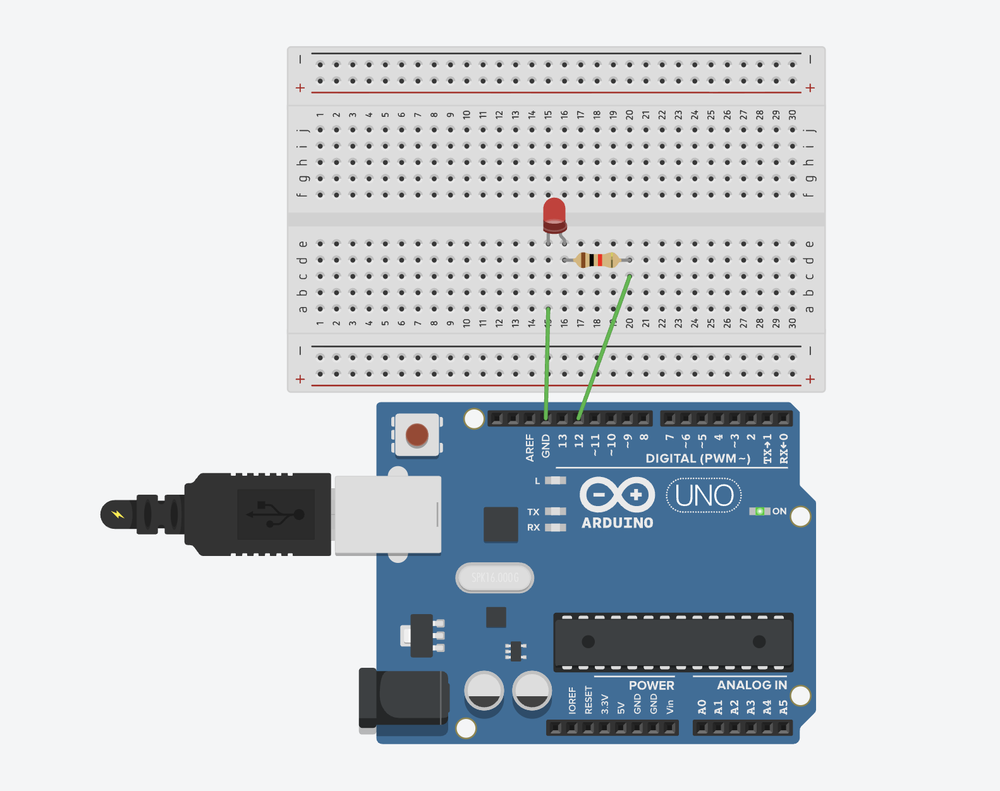
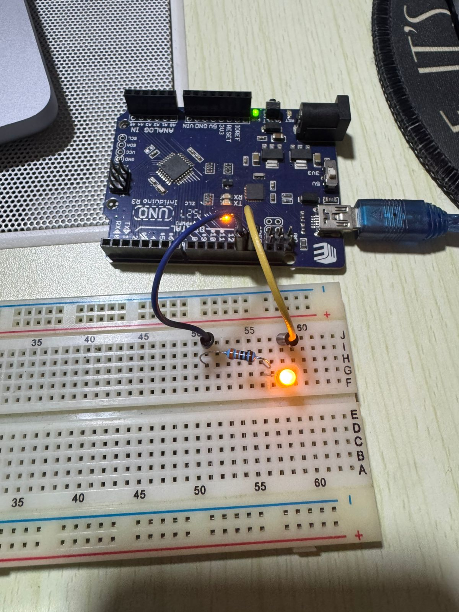

# LED ON Example

A simple Arduino project to turn on an LED and keep it on. This is the perfect first project for beginners learning Arduino programming.

## 📋 Project Description

This project demonstrates the most basic Arduino functionality: controlling an LED. The LED will turn on when the Arduino starts and remain on continuously. This simple example introduces digital output control and the fundamental Arduino program structure.

**Difficulty Level:** Beginner  
**Learning Objectives:**
- Understanding digital pins and outputs
- Using `pinMode()` and `digitalWrite()` functions
- Understanding the `setup()` and `loop()` structure
- Learning how to control hardware with code

## 🔧 Components Required

- **Arduino Board** (Uno, Nano, Mega, or compatible)
- **USB Cable** (to connect Arduino to computer)
- **LED** (optional, for external LED - any color)
- **Resistor** (330Ω, optional - only needed for external LED)
- **Breadboard** (optional - only needed for external LED)
- **Jumper Wires** (optional - only needed for external LED)

## 🔌 Circuit Connections

This project uses **Pin 12** for the external LED. Pin 12 does not have a built-in LED, so you need to connect an external LED.

**Circuit Connections:**

```
LED Anode (long leg) → Resistor (330Ω) → Pin 12
LED Cathode (short leg) → GND
```

**Visual Connection Guide:**
```
Arduino Board:
    Pin 12 ────[330Ω Resistor]───[LED Anode (+)]
    
    GND ─────────────────────────[LED Cathode (-)]
```

### Circuit Diagrams

**Tinkercad Simulation:**
https://www.tinkercad.com/things/5T2xThD240a-led-turn-on



**Real Circuit Photo:**


**Important Notes:**
- The LED anode (positive, long leg) connects to the resistor, then to pin 12
- The LED cathode (negative, short leg) connects directly to GND
- Always use a resistor (220Ω-330Ω) to protect the LED from excessive current
- Pin 12 is used instead of pin 13 to avoid the built-in LED (pin 13 has a built-in LED on most Arduino boards)
- This allows independent control of the external LED

## 💻 Code Explanation

### Key Functions

**`pinMode(LED_PIN, OUTPUT)`**
- Configures pin 12 as an output pin
- Must be called in `setup()` before using the pin
- `OUTPUT` means the pin will send signals (not receive them)

**`digitalWrite(LED_PIN, HIGH)`**
- Sets pin 12 to HIGH (5V or 3.3V depending on board)
- Turns the LED ON

**`digitalWrite(LED_PIN, LOW)`**
- Sets pin 12 to LOW (0V)
- Turns the LED OFF

**`Serial.begin(9600)`**
- Initializes serial communication at 9600 baud rate
- Allows sending debug messages to the Serial Monitor
- Must be called in `setup()` before using `Serial.println()`

**`Serial.println()`**
- Sends text messages to the Serial Monitor
- Useful for debugging and understanding program flow

### Program Flow

1. **`setup()`** - Runs once when Arduino starts:
   - Configures pin 12 as output
   - Initializes serial communication for debugging
   - Turns the LED ON (sets pin to HIGH)
   - Sends "LED ON" message to Serial Monitor

2. **`loop()`** - Runs continuously:
   - Empty in this example (LED stays ON from setup)
   - The LED remains on because the pin state was set in `setup()`

## 🚀 Usage Instructions

### Step 1: Open the Code

1. Open Arduino IDE
2. Open the file `led.ino` from this folder

### Step 2: Connect Arduino

1. Connect your Arduino board to your computer using the USB cable
2. Wait for the computer to recognize the device

### Step 3: Configure Arduino IDE

1. Go to **Tools → Board** and select your Arduino model (e.g., "Arduino Uno")
2. Go to **Tools → Port** and select the COM port where your Arduino is connected
   - On Windows: Usually `COM3`, `COM4`, etc.
   - On Mac/Linux: Usually `/dev/tty.usbmodem...` or `/dev/ttyUSB0`

### Step 4: Upload the Code

1. Click the **Upload** button (→) in Arduino IDE
2. Wait for the compilation and upload to complete
3. You should see "Done uploading" message

### Step 5: Observe the Result

- The external LED connected to pin 12 should turn on and stay on
- Open the Serial Monitor (Tools → Serial Monitor) to see debug messages
- You should see "LED ON Example Started" and "LED ON" messages

## 🔍 Expected Behavior

- LED turns ON when Arduino starts
- LED remains ON continuously
- Serial Monitor shows "LED ON Example Started" and "LED ON" messages
- LED will stay on until Arduino is reset or power is disconnected

## 🛠️ Troubleshooting

### LED Not Turning On

**Problem:** Nothing happens after uploading
- **Solution:** Check that the correct board and port are selected in Arduino IDE
- **Solution:** Verify the upload completed successfully (check for errors)
- **Solution:** Try pressing the reset button on your Arduino board
- **Solution:** Make sure the LED is properly connected to pin 12 (not pin 13)

### External LED Not Working

**Problem:** External LED doesn't light up
- **Solution:** Check LED polarity - the long leg (anode) must connect to pin 12, short leg (cathode) to GND
- **Solution:** Verify the resistor is connected (330Ω recommended)
- **Solution:** Verify the LED is connected to pin 12 (check the `LED_PIN` constant in code)
- **Solution:** Test the LED by connecting it directly to 5V and GND (with resistor) to verify it works
- **Solution:** Make sure connections are secure and not loose

### LED Stays Off

**Problem:** LED doesn't turn on
- **Solution:** Check that the code uploaded successfully
- **Solution:** Verify pin 12 is being used (check the `LED_PIN` constant in code)
- **Solution:** Try pressing the reset button on Arduino to restart the program
- **Solution:** Make sure the LED is properly connected to pin 12 (check polarity and connections)

### Serial Monitor Shows Nothing

**Problem:** No messages in Serial Monitor
- **Solution:** Make sure Serial Monitor is set to 9600 baud (bottom right of Serial Monitor window)
- **Solution:** Click the Serial Monitor icon after uploading the code

## 🎓 Learning Concepts

This project teaches:
- **Digital Output:** Controlling on/off states with `digitalWrite()`
- **Pin Configuration:** Setting up pins as outputs with `pinMode()`
- **Arduino Structure:** Understanding `setup()` (runs once) and `loop()` (runs continuously)
- **Hardware Control:** Direct control of physical components
- **Serial Communication:** Sending debug messages to the computer

## 🔄 Next Steps

After mastering this project, try:
- Modifying the code to make the LED blink (add `delay()` and toggle HIGH/LOW in `loop()`)
- Adding multiple LEDs on different pins
- Using different pins for the LED
- Creating patterns (Morse code, SOS signal, etc.)
- Controlling LED with a button
- Using `analogWrite()` for brightness control (PWM pins)

## 📝 Notes

- This project uses **Pin 12** for the external LED
- Pin 12 does not have a built-in LED, allowing independent control
- Pin 13 has a built-in LED on most Arduino boards, but this project uses pin 12 to avoid interference
- Always use a current-limiting resistor (220Ω-330Ω) with LEDs to prevent damage
- The LED state set in `setup()` persists because digital pins maintain their state
- To turn the LED off, you would need to add `digitalWrite(LED_PIN, LOW)` in the code
- You can change `LED_PIN` to any digital pin (2-13) if needed

## 📚 Related Resources

- [Arduino Digital Pins Reference](https://www.arduino.cc/reference/en/language/functions/digital-io/)
- [Arduino Serial Communication](https://www.arduino.cc/reference/en/language/functions/communication/serial/)
- [Arduino setup() and loop() Functions](https://www.arduino.cc/reference/en/language/structure/sketch/setup/)
- [LED Basics](https://www.arduino.cc/en/Tutorial/BuiltInExamples/Blink)

---

**Author:** XergioAleX  
**Date:** 2025  
**Version:** 1.0  
**Project:** LED ON Example

