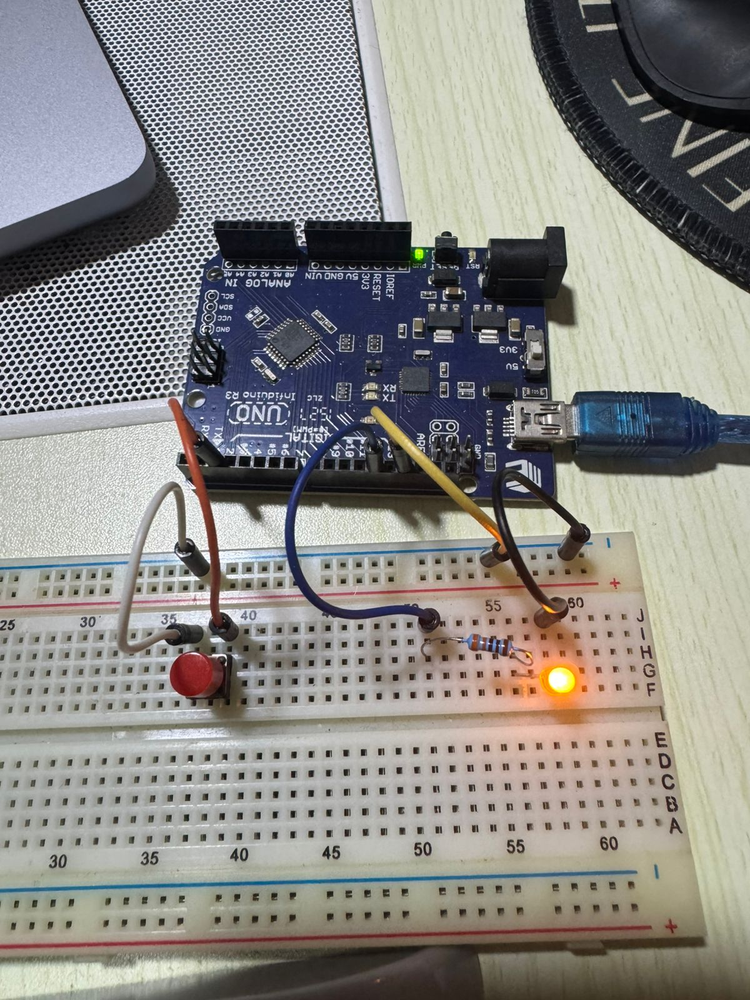

# LED Button Control

Control an LED with a push button. Press the button to toggle the LED on and off. This project introduces digital input reading and interactive hardware control.

## 📋 Project Description

This project demonstrates how to read digital inputs (button presses) and use them to control outputs (LED). Each time you press the button, the LED toggles between ON and OFF states. This is a fundamental example of user interaction with Arduino.

**Difficulty Level:** Beginner  
**Learning Objectives:**
- Understanding digital inputs and outputs
- Using `digitalRead()` to read button states
- Implementing edge detection for button presses
- Toggling LED states based on user input
- Using internal pull-up resistors
- Understanding button debouncing

## 🔧 Components Required

- **Arduino Board** (Uno, Nano, Mega, or compatible)
- **USB Cable** (to connect Arduino to computer)
- **LED** (any color)
- **Resistor** (330Ω for LED)
- **Push Button** (momentary push button switch)
- **Breadboard** (for easy connections)
- **Jumper Wires** (for connections)

## 🔌 Circuit Connections

**Circuit Connections:**

```
LED Circuit:
  LED Anode (long leg) → Resistor (330Ω) → Pin 12
  LED Cathode (short leg) → GND

Button Circuit:
  Button Pin 1 → Pin 2
  Button Pin 2 → GND
```

**Visual Connection Guide:**
```
Arduino Board:
    Pin 12 ────[330Ω Resistor]───[LED Anode (+)]
    GND ─────────────────────────[LED Cathode (-)]
    
    Pin 2 ───────────────────────[Button Pin 1]
    GND ────────────────────────[Button Pin 2]
```

### Circuit Diagrams

**Tinkercad Simulation:**
https://www.tinkercad.com/things/diYfO1xOBvw-led-button


**Real Circuit Photo:**


**Important Notes:**
- The LED anode (positive, long leg) connects to the resistor, then to pin 12
- The LED cathode (negative, short leg) connects directly to GND
- The button connects between pin 2 and GND
- We use `INPUT_PULLUP` mode, so no external resistor is needed for the button
- When button is NOT pressed: pin 2 reads HIGH (due to internal pull-up)
- When button IS pressed: pin 2 reads LOW (connected to GND)
- Always use a current-limiting resistor (220Ω-330Ω) with LEDs

## 💻 Code Explanation

### Key Functions

**`pinMode(BUTTON_PIN, INPUT_PULLUP)`**
- Configures pin 2 as an input with internal pull-up resistor
- `INPUT_PULLUP` enables Arduino's internal pull-up resistor (connects pin to 5V through a resistor)
- When button is not pressed, pin reads HIGH
- When button is pressed (connects to GND), pin reads LOW
- No external resistor needed for the button

**`digitalRead(BUTTON_PIN)`**
- Reads the current state of pin 2
- Returns `HIGH` (1) or `LOW` (0)
- Used to detect if button is pressed or not

**`digitalWrite(LED_PIN, ledState)`**
- Sets the LED pin to the current `ledState` (HIGH or LOW)
- Controls whether LED is ON or OFF

**Edge Detection Logic:**
```cpp
if (buttonState == LOW && lastButtonState == HIGH)
```
- Detects the moment button is pressed (transition from HIGH to LOW)
- Prevents multiple toggles from a single button press
- Only toggles LED when button state changes, not while it's held down

**Toggle Logic:**
```cpp
ledState = !ledState;
```
- Inverts the current LED state
- If LED was OFF (LOW), it becomes ON (HIGH)
- If LED was ON (HIGH), it becomes OFF (LOW)

### Program Flow

1. **`setup()`** - Runs once when Arduino starts:
   - Configures pin 12 as output (LED)
   - Configures pin 2 as input with pull-up (button)
   - Initializes serial communication
   - Sets initial LED state to OFF

2. **`loop()`** - Runs continuously:
   - Read current button state
   - Check if button was just pressed (edge detection)
   - If button pressed, toggle LED state
   - Update LED output
   - Save button state for next iteration
   - Repeat

## 🚀 Usage Instructions

### Step 1: Build the Circuit

1. Connect LED to pin 12:
   - LED anode → Resistor (330Ω) → Pin 12
   - LED cathode → GND

2. Connect button to pin 2:
   - One button terminal → Pin 2
   - Other button terminal → GND

### Step 2: Open and Upload Code

1. Open Arduino IDE
2. Open the file `led_button.ino` from this folder
3. Connect your Arduino board
4. Select the correct board and port in Arduino IDE
5. Click **Upload** button

### Step 3: Test the Circuit

1. After uploading, the LED should be OFF initially
2. Press the button - LED should turn ON
3. Press the button again - LED should turn OFF
4. Each button press toggles the LED state
5. Open Serial Monitor to see status messages

## 🔍 Expected Behavior

- LED starts in OFF state
- Pressing the button toggles LED between ON and OFF
- Each button press changes the LED state once
- Serial Monitor shows "LED turned ON" or "LED turned OFF" messages
- Button must be released and pressed again to toggle again

## 🛠️ Troubleshooting

### LED Doesn't Turn On

**Problem:** LED never turns on when button is pressed
- **Solution:** Check LED connections - anode to pin 12, cathode to GND
- **Solution:** Verify LED polarity (long leg = anode, short leg = cathode)
- **Solution:** Check that resistor is connected properly
- **Solution:** Verify pin 12 is being used (check `LED_PIN` constant)

### Button Doesn't Work

**Problem:** Button press doesn't toggle LED
- **Solution:** Check button connections - one terminal to pin 2, other to GND
- **Solution:** Verify button is a momentary push button (not a toggle switch)
- **Solution:** Test button by connecting directly to 5V and GND to verify it works
- **Solution:** Check that pin 2 is being used (check `BUTTON_PIN` constant)
- **Solution:** Make sure connections are secure

### LED Toggles Multiple Times

**Problem:** LED toggles multiple times with one button press
- **Solution:** This is button bounce - the code includes a 50ms delay to minimize this
- **Solution:** If problem persists, increase the delay value (e.g., `delay(100)`)
- **Solution:** Check button quality - some buttons have more bounce than others

### LED State Doesn't Change

**Problem:** LED stays in one state and doesn't toggle
- **Solution:** Check Serial Monitor to see if button presses are being detected
- **Solution:** Verify button is properly connected (pin 2 to GND when pressed)
- **Solution:** Try pressing button more firmly
- **Solution:** Check if button is making good contact

### Serial Monitor Shows Nothing

**Problem:** No messages in Serial Monitor
- **Solution:** Make sure Serial Monitor is set to 9600 baud
- **Solution:** Click Serial Monitor icon after uploading code
- **Solution:** Verify serial communication is initialized in `setup()`

## 🎓 Learning Concepts

This project teaches:
- **Digital Input:** Reading button states with `digitalRead()`
- **Pull-up Resistors:** Using internal pull-up resistors (`INPUT_PULLUP`)
- **Edge Detection:** Detecting button press events (state changes)
- **State Toggling:** Changing output state based on input
- **Button Debouncing:** Handling mechanical switch bounce
- **Interactive Control:** User interaction with hardware

## 🔄 Next Steps

After mastering this project, try:
- Adding multiple buttons to control different LEDs
- Using different button behaviors (momentary vs toggle)
- Creating a button that turns LED on while held (not toggle)
- Adding multiple LEDs with different button controls
- Implementing button combinations (press two buttons together)
- Adding LED feedback for button presses
- Creating a simple game or interactive project

## 📝 Notes

- This project uses **Pin 12** for LED and **Pin 2** for button
- Internal pull-up resistor eliminates need for external resistor on button
- Edge detection ensures LED toggles only once per button press
- Button debouncing delay (50ms) prevents multiple toggles from switch bounce
- You can change pins by modifying `LED_PIN` and `BUTTON_PIN` constants
- Button reads LOW when pressed (due to pull-up configuration)
- The toggle logic (`ledState = !ledState`) inverts the current state

## 📚 Related Resources

- [Arduino Digital Input](https://www.arduino.cc/reference/en/language/functions/digital-io/digitalread/)
- [Arduino INPUT_PULLUP](https://www.arduino.cc/en/Tutorial/DigitalPins)
- [Button Debouncing](https://www.arduino.cc/en/Tutorial/Debounce)
- [Arduino Digital Pins Reference](https://www.arduino.cc/reference/en/language/functions/digital-io/)

---

**Author:** XergioAleX  
**Date:** 2025  
**Version:** 1.0  
**Project:** LED Button Control

