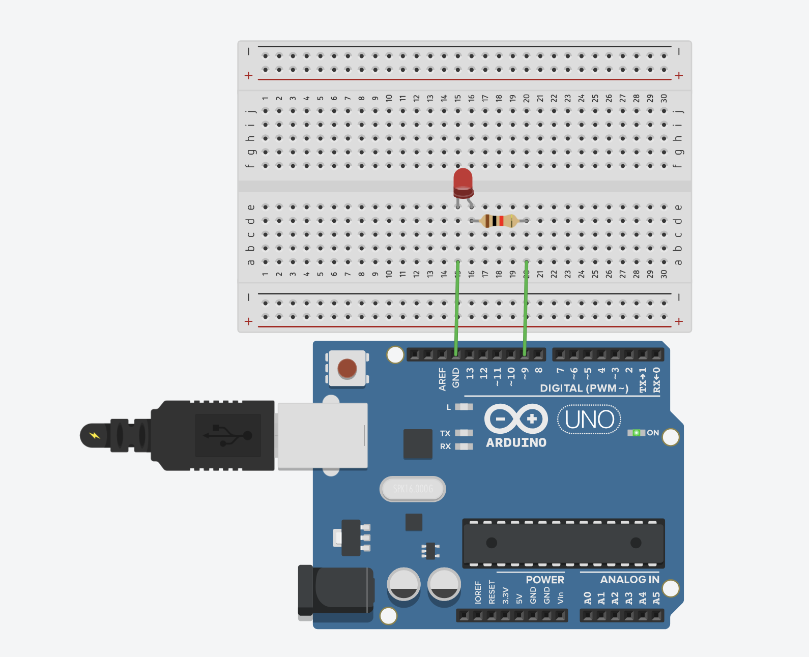

# LED Fade Effect

Create a smooth fade in/out effect on an LED using PWM (Pulse Width Modulation). This project demonstrates analog output control, allowing you to control LED brightness smoothly rather than just ON/OFF.

## 📋 Project Description

This project creates a smooth fading effect where the LED gradually brightens from completely off to fully on, then gradually dims back to off, repeating continuously. This is achieved using PWM (Pulse Width Modulation), which allows us to control the brightness of the LED by varying the duty cycle of the signal.

**Difficulty Level:** Beginner  
**Learning Objectives:**
- Understanding PWM (Pulse Width Modulation)
- Using `analogWrite()` for analog output
- Controlling LED brightness (not just ON/OFF)
- Understanding PWM-capable pins
- Creating smooth transitions and effects
- Working with variables and conditional logic

## 🔧 Components Required

- **Arduino Board** (Uno, Nano, Mega, or compatible)
- **USB Cable** (to connect Arduino to computer)
- **LED** (any color)
- **Resistor** (330Ω for LED)
- **Breadboard** (for easy connections)
- **Jumper Wires** (for connections)

## 🔌 Circuit Connections

**Circuit Connections:**

```
LED Circuit:
  LED Anode (long leg) → Resistor (330Ω) → Pin 9 (PWM pin)
  LED Cathode (short leg) → GND
```

**Visual Connection Guide:**
```
Arduino Board:
    Pin 9 (~) ────[330Ω Resistor]───[LED Anode (+)]
    GND ────────────────────────────[LED Cathode (-)]
```

### Circuit Diagrams

**Tinkercad Simulation:**
https://www.tinkercad.com/things/hdJMq3zdc4p-4-led-fade



**Real Circuit Photo:**


**Important Notes:**
- The LED anode (positive, long leg) connects to the resistor, then to pin 9
- The LED cathode (negative, short leg) connects directly to GND
- **Pin 9 must be a PWM-capable pin** (marked with ~ on Arduino Uno)
- PWM pins on Arduino Uno: 3, 5, 6, 9, 10, 11
- Always use a current-limiting resistor (220Ω-330Ω) with LEDs

## 💻 Code Explanation

### Key Concepts

**PWM (Pulse Width Modulation):**
- PWM is a technique to simulate analog output using digital signals
- It rapidly switches a pin ON and OFF at different rates
- The ratio of ON time to OFF time (duty cycle) determines the brightness
- Higher duty cycle = brighter LED, lower duty cycle = dimmer LED

**PWM Values:**
- `analogWrite()` accepts values from 0 to 255
- `0` = fully OFF (0% duty cycle)
- `255` = fully ON (100% duty cycle)
- `128` = 50% brightness (50% duty cycle)

### Key Functions

**`analogWrite(LED_PIN, brightness)`**
- Writes an analog value (PWM wave) to a pin
- First parameter: pin number (must be PWM-capable)
- Second parameter: brightness value (0-255)
- Creates a square wave with varying duty cycle
- Higher values = brighter LED

**PWM-Capable Pins:**
- Arduino Uno: pins 3, 5, 6, 9, 10, 11 (marked with ~)
- Arduino Nano: pins 3, 5, 6, 9, 10, 11
- Arduino Mega: pins 2-13, 44-46
- Check your board's documentation for PWM pins

### Program Flow

1. **`setup()`** - Runs once when Arduino starts:
   - Configures pin 9 as output (LED)
   - Initializes serial communication
   - Sets initial brightness to 0 (LED off)

2. **`loop()`** - Runs continuously:
   - Write current brightness to LED using `analogWrite()`
   - Print brightness value to Serial Monitor
   - Increase brightness by `fadeAmount`
   - Check if brightness reached limits (0 or 255)
   - If at limit, reverse the fade direction
   - Wait 30ms before next iteration
   - Repeat

**Fade Logic:**
```cpp
brightness = brightness + fadeAmount;

if (brightness <= 0 || brightness >= 255) {
  fadeAmount = -fadeAmount;  // Reverse direction
}
```

- Starts at 0, increases to 255, then decreases back to 0
- When brightness reaches 255, `fadeAmount` becomes negative (fade out)
- When brightness reaches 0, `fadeAmount` becomes positive (fade in)
- Creates continuous fade in/out cycle

## 🚀 Usage Instructions

### Step 1: Build the Circuit

1. Connect LED to pin 9:
   - LED anode → Resistor (330Ω) → Pin 9
   - LED cathode → GND

**Important:** Make sure you use a PWM-capable pin (marked with ~ on Arduino Uno: 3, 5, 6, 9, 10, 11)

### Step 2: Open and Upload Code

1. Open Arduino IDE
2. Open the file `led_fade.ino` from this folder
3. Connect your Arduino board
4. Select the correct board and port in Arduino IDE
5. Click **Upload** button

### Step 3: Observe the Effect

1. After uploading, the LED should start fading in and out smoothly
2. Watch the LED gradually brighten from off to fully on
3. Then watch it gradually dim from fully on to off
4. This cycle repeats continuously
5. Open Serial Monitor to see brightness values (0-255)

## 🔍 Expected Behavior

- LED starts at minimum brightness (0)
- LED gradually increases brightness to maximum (255)
- LED then gradually decreases brightness back to minimum (0)
- Cycle repeats continuously
- Fade effect is smooth and continuous
- Serial Monitor shows brightness values from 0 to 255 and back

## 🛠️ Troubleshooting

### LED Doesn't Fade (Stays On or Off)

**Problem:** LED doesn't fade, just stays on or off
- **Solution:** Verify you're using a PWM-capable pin (3, 5, 6, 9, 10, 11 on Uno)
- **Solution:** Check that pin 9 is being used (check `LED_PIN` constant)
- **Solution:** Make sure connections are secure
- **Solution:** Try a different PWM pin if pin 9 doesn't work

### Fade is Too Fast or Too Slow

**Problem:** LED fades too quickly or too slowly
- **Solution:** Adjust `delay(30)` value - lower = faster, higher = slower
- **Solution:** Adjust `fadeAmount` value - higher = faster fade, lower = slower fade
- **Solution:** Try `delay(50)` for slower fade or `delay(10)` for faster fade
- **Solution:** Try `fadeAmount = 3` for slower or `fadeAmount = 10` for faster

### LED Doesn't Turn On

**Problem:** LED never turns on
- **Solution:** Check LED connections - anode to pin 9, cathode to GND
- **Solution:** Verify LED polarity (long leg = anode, short leg = cathode)
- **Solution:** Check that resistor is connected properly
- **Solution:** Verify you're using a PWM-capable pin

### Fade is Not Smooth

**Problem:** LED brightness changes in steps rather than smoothly
- **Solution:** Reduce `fadeAmount` value (e.g., from 5 to 2 or 3)
- **Solution:** Reduce `delay()` value for more frequent updates
- **Solution:** This is normal if `fadeAmount` is too large - smaller steps = smoother fade

### Serial Monitor Shows Nothing

**Problem:** No messages in Serial Monitor
- **Solution:** Make sure Serial Monitor is set to 9600 baud
- **Solution:** Click Serial Monitor icon after uploading code
- **Solution:** Verify serial communication is initialized in `setup()`

## 🎓 Learning Concepts

This project teaches:
- **PWM (Pulse Width Modulation):** Simulating analog output with digital signals
- **Analog Output:** Controlling brightness/voltage levels, not just ON/OFF
- **`analogWrite()` Function:** Writing PWM values (0-255) to pins
- **PWM-Capable Pins:** Understanding which pins support PWM
- **Variable Control:** Using variables to create dynamic effects
- **Conditional Logic:** Reversing direction when limits are reached
- **Smooth Transitions:** Creating gradual changes over time

## 🔄 Next Steps

After mastering this project, try:
- **Multiple LED Fade:** Fade multiple LEDs at different rates
- **Button-Controlled Fade:** Use a button to start/stop fade or change speed
- **Potentiometer Control:** Control LED brightness with a potentiometer (analog input)
- **Different Fade Patterns:** Create fade patterns (fast-slow-fast, etc.)
- **RGB LED Fade:** Fade different colors on an RGB LED
- **Breathing Effect:** Create a "breathing" LED effect with exponential fade
- **Music-Responsive:** Make LED brightness respond to sound/music

## 📝 Notes

- This project uses **Pin 9** for LED (must be PWM-capable)
- PWM pins on Arduino Uno are marked with ~ (3, 5, 6, 9, 10, 11)
- `analogWrite()` values range from 0 (off) to 255 (fully on)
- `fadeAmount` controls how much brightness changes each step
- `delay()` controls how fast the fade updates (lower = faster updates)
- You can change pins by modifying `LED_PIN` constant (must be PWM-capable)
- The fade direction reverses automatically at 0 and 255
- PWM frequency is approximately 490 Hz on most pins (980 Hz on pins 5 and 6)

## 🔬 Experiment Ideas

1. **Change Fade Speed:**
   - Modify `fadeAmount` (try 1, 3, 10, 20)
   - Modify `delay()` value (try 10, 50, 100)

2. **Different Fade Patterns:**
   - Fade only up (reset to 0 at 255)
   - Fade only down (reset to 255 at 0)
   - Fade to middle and back

3. **Multiple LEDs:**
   - Add more LEDs on different PWM pins
   - Fade them at different rates
   - Create synchronized or alternating patterns

## 📚 Related Resources

- [Arduino analogWrite()](https://www.arduino.cc/reference/en/language/functions/analog-io/analogwrite/)
- [Arduino PWM Tutorial](https://www.arduino.cc/en/Tutorial/PWM)
- [Pulse Width Modulation Explained](https://www.arduino.cc/en/Tutorial/SecretsOfArduinoPWM)
- [Arduino Analog Output](https://www.arduino.cc/reference/en/language/functions/analog-io/)

---

**Author:** XergioAleX  
**Date:** 2025  
**Version:** 1.0  
**Project:** LED Fade Effect

