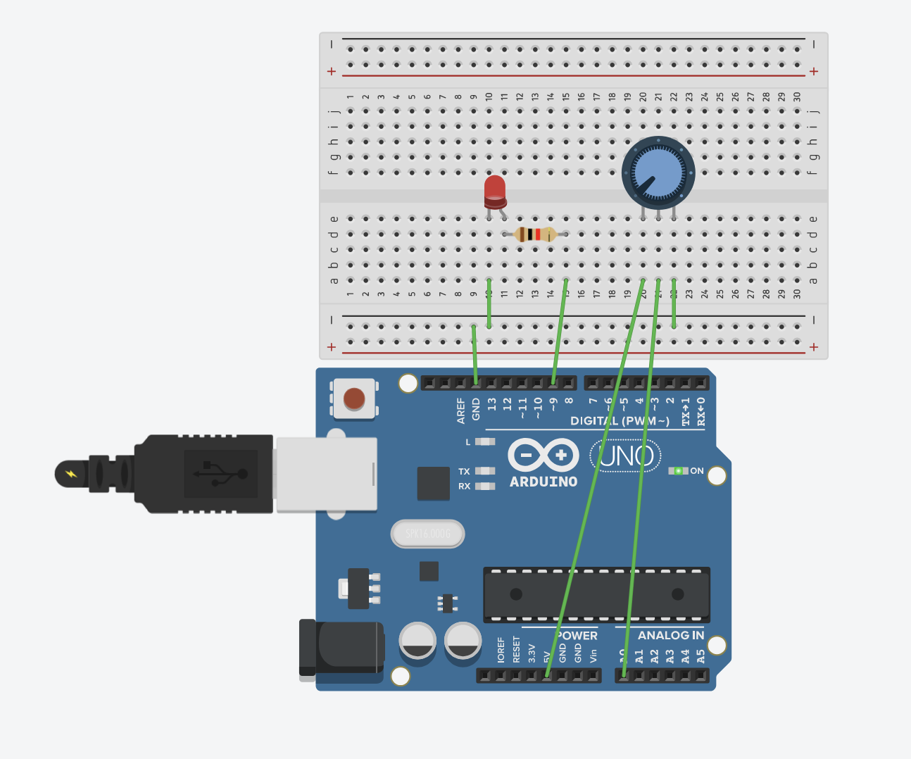
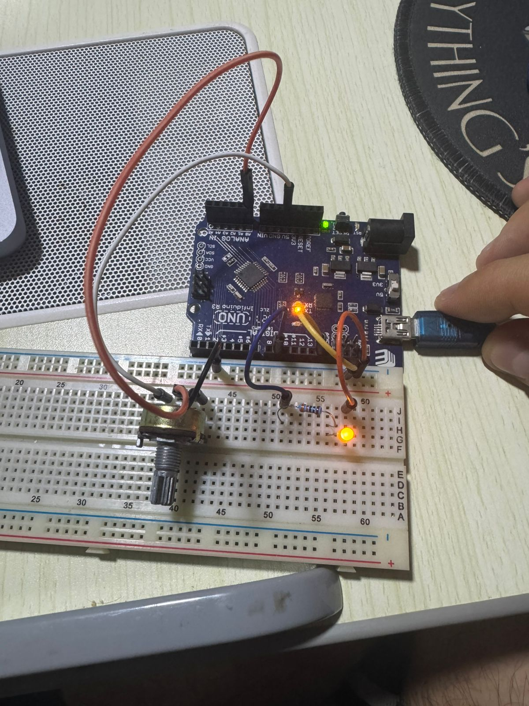

# LED Brightness Control with Potentiometer

Control LED brightness using a potentiometer. Rotate the potentiometer to smoothly adjust the LED brightness from completely off to fully on. This project demonstrates analog input reading and how to use sensor values to control outputs.

## 📋 Project Description

This project allows you to control LED brightness by rotating a potentiometer. As you turn the potentiometer, the LED brightness changes smoothly in real-time. This demonstrates the connection between analog input (reading sensor values) and analog output (controlling brightness with PWM).

**Difficulty Level:** Beginner  
**Learning Objectives:**
- Understanding analog inputs
- Using `analogRead()` to read sensor values
- Using `map()` function to scale values
- Connecting analog input to analog output
- Reading potentiometer values
- Real-time control of LED brightness

## 🔧 Components Required

- **Arduino Board** (Uno, Nano, Mega, or compatible)
- **USB Cable** (to connect Arduino to computer)
- **LED** (any color)
- **Resistor** (330Ω for LED)
- **Potentiometer** (10kΩ recommended, but any value works)
- **Breadboard** (for easy connections)
- **Jumper Wires** (for connections)

## 🔌 Circuit Connections

**Circuit Connections:**

```
LED Circuit:
  LED Anode (long leg) → Resistor (330Ω) → Pin 9 (PWM pin)
  LED Cathode (short leg) → GND

Potentiometer Circuit:
  Potentiometer Pin 1 (left) → 5V
  Potentiometer Pin 2 (middle/wiper) → Pin A0 (analog input)
  Potentiometer Pin 3 (right) → GND
```

**Visual Connection Guide:**
```
Arduino Board:
    Pin 9 (~) ────[330Ω Resistor]───[LED Anode (+)]
    GND ────────────────────────────[LED Cathode (-)]
    
    5V ────────────────────────────[Pot Pin 1]
    Pin A0 ────────────────────────[Pot Pin 2 (wiper)]
    GND ───────────────────────────[Pot Pin 3]
```

### Circuit Diagrams

**Tinkercad Simulation:**
https://www.tinkercad.com/things/avKlCoYaFTy-5-led-potentiometer



**Real Circuit Photo:**


**Important Notes:**
- The LED anode (positive, long leg) connects to the resistor, then to pin 9
- The LED cathode (negative, short leg) connects directly to GND
- **Pin 9 must be a PWM-capable pin** (marked with ~ on Arduino Uno)
- Potentiometer pin 1 connects to 5V (power)
- Potentiometer pin 2 (wiper/middle) connects to analog pin A0
- Potentiometer pin 3 connects to GND (ground)
- The potentiometer acts as a voltage divider
- Always use a current-limiting resistor (220Ω-330Ω) with LEDs

## 💻 Code Explanation

### Key Concepts

**Analog Input:**
- Arduino has 6 analog input pins (A0-A5 on Uno)
- These pins can read voltage levels from 0V to 5V
- `analogRead()` returns values from 0 to 1023
- 0 = 0V (ground)
- 1023 = 5V (maximum voltage)
- 512 ≈ 2.5V (middle)

**Potentiometer (Variable Resistor):**
- A potentiometer is a three-terminal resistor with a rotating contact
- Acts as a voltage divider
- Rotating the knob changes the voltage on the wiper (middle pin)
- Full rotation: 0V to 5V


*Potentiometer with labeled pins: GND (top), Output/Wiper (middle), Vcc (bottom). The "B10K" marking indicates a 10kΩ linear potentiometer.*

**Value Mapping:**
- Potentiometer reads 0-1023 (10-bit resolution)
- LED PWM needs 0-255 (8-bit resolution)
- `map()` function scales values from one range to another

### Key Functions

**`analogRead(POTENTIOMETER_PIN)`**
- Reads the analog value from pin A0
- Returns a value from 0 to 1023
- 0 = 0V (potentiometer at minimum)
- 1023 = 5V (potentiometer at maximum)
- No `pinMode()` needed for analog pins (they're inputs by default)

**`map(value, fromLow, fromHigh, toLow, toHigh)`**
- Maps a value from one range to another
- `map(potValue, 0, 1023, 0, 255)` scales 0-1023 to 0-255
- Useful for converting sensor ranges to output ranges
- More readable than manual calculation

**`analogWrite(LED_PIN, ledBrightness)`**
- Writes PWM value to LED pin
- Accepts values from 0 (off) to 255 (fully on)
- Controls LED brightness smoothly

### Program Flow

1. **`setup()`** - Runs once when Arduino starts:
   - Configures pin 9 as output (LED)
   - Initializes serial communication
   - Note: Analog pins don't need pinMode() - they're inputs by default

2. **`loop()`** - Runs continuously:
   - Read potentiometer value (0-1023) using `analogRead()`
   - Map the value to LED brightness range (0-255) using `map()`
   - Write brightness to LED using `analogWrite()`
   - Print values to Serial Monitor
   - Small delay for stability
   - Repeat

**Value Flow:**
```
Potentiometer Rotation
    ↓
Voltage Change (0V-5V)
    ↓
analogRead() → 0-1023
    ↓
map() → 0-255
    ↓
analogWrite() → LED Brightness
```

## 🚀 Usage Instructions

### Step 1: Build the Circuit

1. **Connect LED to pin 9:**
   - LED anode → Resistor (330Ω) → Pin 9
   - LED cathode → GND

2. **Connect potentiometer:**
   - Potentiometer pin 1 (left) → 5V
   - Potentiometer pin 2 (middle/wiper) → Pin A0
   - Potentiometer pin 3 (right) → GND

**Important:** 
- Make sure you use a PWM-capable pin for LED (marked with ~ on Arduino Uno: 3, 5, 6, 9, 10, 11)
- Potentiometer orientation: The wiper (middle pin) is the most important - it connects to A0

### Step 2: Open and Upload Code

1. Open Arduino IDE
2. Open the file `led_potentiometer.ino` from this folder
3. Connect your Arduino board
4. Select the correct board and port in Arduino IDE
5. Click **Upload** button

### Step 3: Test the Circuit

1. After uploading, open Serial Monitor (9600 baud)
2. Rotate the potentiometer clockwise - LED should get brighter
3. Rotate the potentiometer counterclockwise - LED should get dimmer
4. Watch Serial Monitor to see potentiometer and brightness values
5. LED brightness should change smoothly in real-time

## 🔍 Expected Behavior

- Rotating potentiometer clockwise increases LED brightness
- Rotating potentiometer counterclockwise decreases LED brightness
- LED brightness changes smoothly and in real-time
- Serial Monitor shows potentiometer values (0-1023) and LED brightness (0-255)
- At minimum rotation: LED is off (brightness = 0)
- At maximum rotation: LED is fully on (brightness = 255)
- Smooth transition between all brightness levels

## 🛠️ Troubleshooting

### LED Doesn't Change Brightness

**Problem:** LED doesn't respond to potentiometer rotation
- **Solution:** Check potentiometer connections - wiper (middle pin) must connect to A0
- **Solution:** Verify potentiometer pin 1 connects to 5V and pin 3 to GND
- **Solution:** Check that pin 9 is being used for LED (check `LED_PIN` constant)
- **Solution:** Make sure LED is connected to a PWM-capable pin
- **Solution:** Test potentiometer by reading values in Serial Monitor

### LED Stays On or Off

**Problem:** LED stays at one brightness level regardless of potentiometer
- **Solution:** Check potentiometer wiring - all three pins must be connected
- **Solution:** Verify potentiometer is working - test with multimeter
- **Solution:** Check Serial Monitor to see if potentiometer values are changing
- **Solution:** Try a different potentiometer if current one is faulty

### Brightness Changes in Steps (Not Smooth)

**Problem:** LED brightness changes in jumps rather than smoothly
- **Solution:** This is normal if potentiometer is low quality or dirty
- **Solution:** Clean potentiometer contacts if possible
- **Solution:** Try a different potentiometer
- **Solution:** Add smoothing code (average multiple readings)

### Wrong Brightness Range

**Problem:** LED doesn't go fully off or fully on
- **Solution:** Check potentiometer connections - may be reversed
- **Solution:** Verify 5V and GND connections to potentiometer
- **Solution:** Test potentiometer range with Serial Monitor
- **Solution:** Adjust map() function if needed: `map(potValue, 0, 1023, 0, 255)`

### Serial Monitor Shows Nothing

**Problem:** No values in Serial Monitor
- **Solution:** Make sure Serial Monitor is set to 9600 baud
- **Solution:** Click Serial Monitor icon after uploading code
- **Solution:** Verify serial communication is initialized in `setup()`

### Potentiometer Values Don't Change

**Problem:** Serial Monitor shows same value regardless of rotation
- **Solution:** Check potentiometer connections - wiper must connect to A0
- **Solution:** Verify 5V and GND are connected to outer pins
- **Solution:** Test potentiometer with multimeter
- **Solution:** Try a different analog pin (A1, A2, etc.)

## 🎓 Learning Concepts

This project teaches:
- **Analog Input:** Reading continuous voltage values (0-5V) with `analogRead()`
- **Analog Pins:** Understanding A0-A5 analog input pins
- **Potentiometer:** Using variable resistors as sensors
- **Voltage Divider:** How potentiometers work as voltage dividers
- **Value Mapping:** Converting between different value ranges with `map()`
- **Real-time Control:** Using sensor input to control output in real-time
- **Analog to Analog:** Connecting analog input to analog output

## 🔄 Next Steps

After mastering this project, try:
- **Multiple LEDs:** Control multiple LEDs with one potentiometer
- **RGB LED Control:** Use potentiometers to control RGB LED colors
- **Sensor Integration:** Replace potentiometer with light sensor (LDR) or temperature sensor
- **Servo Motor Control:** Control servo motor position with potentiometer
- **Motor Speed Control:** Control DC motor speed with potentiometer
- **Multiple Potentiometers:** Use multiple potentiometers for different controls
- **Smoothing:** Add smoothing algorithm for more stable readings

## 📝 Notes

- This project uses **Pin 9** for LED (must be PWM-capable) and **Pin A0** for potentiometer
- Analog pins (A0-A5) don't need `pinMode()` - they're inputs by default
- `analogRead()` returns 10-bit values (0-1023) from 0V to 5V
- `analogWrite()` accepts 8-bit values (0-255) for PWM
- `map()` function scales values between ranges
- Potentiometer acts as a voltage divider (0V to 5V)
- You can change pins by modifying `LED_PIN` and `POTENTIOMETER_PIN` constants
- Common potentiometer values: 10kΩ (recommended), 1kΩ, 50kΩ, 100kΩ
- The wiper (middle pin) is the most important connection

## 🔬 Experiment Ideas

1. **Reverse the Control:**
   - Modify `map()` to reverse: `map(potValue, 0, 1023, 255, 0)`
   - Now clockwise = dimmer, counterclockwise = brighter

2. **Limited Range:**
   - Change map range: `map(potValue, 0, 1023, 50, 200)`
   - LED never fully off or on, only medium brightness range

3. **Non-linear Mapping:**
   - Use different mapping for exponential or logarithmic response
   - Create custom brightness curves

4. **Multiple LEDs:**
   - Add more LEDs on different PWM pins
   - Control them with the same or different potentiometers

5. **Add Button:**
   - Combine with button to toggle LED on/off
   - Potentiometer controls brightness when LED is on

## 📚 Related Resources

- [Arduino analogRead()](https://www.arduino.cc/reference/en/language/functions/analog-io/analogread/)
- [Arduino analogWrite()](https://www.arduino.cc/reference/en/language/functions/analog-io/analogwrite/)
- [Arduino map()](https://www.arduino.cc/reference/en/language/functions/math/map/)
- [Arduino Analog Input Pins](https://www.arduino.cc/en/Tutorial/ReadAnalogVoltage)
- [Potentiometer Tutorial](https://www.arduino.cc/en/Tutorial/Potentiometer)

---

**Author:** XergioAleX  
**Date:** 2025  
**Version:** 1.0  
**Project:** LED Brightness Control with Potentiometer

