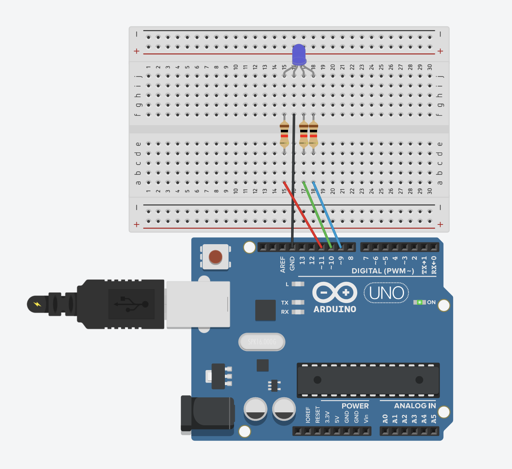

# RGB LED Color Control

Control an RGB LED to display different colors. This project demonstrates how to use multiple PWM channels simultaneously to create various colors by mixing red, green, and blue light.

## 📋 Project Description

This project cycles through different colors on an RGB LED, demonstrating color mixing principles. You'll see red, green, blue, yellow, magenta, cyan, white, and off states. This introduces the concept of controlling multiple PWM outputs simultaneously to create different colors.

**Difficulty Level:** Beginner  
**Learning Objectives:**
- Understanding RGB LEDs (Red, Green, Blue)
- Using multiple PWM channels simultaneously
- Color mixing principles (additive color)
- Controlling three outputs with one function
- Creating custom colors by mixing RGB values
- Working with PWM-capable pins

## 🔧 Components Required

- **Arduino Board** (Uno, Nano, Mega, or compatible)
- **USB Cable** (to connect Arduino to computer)
- **RGB LED** (common cathode or common anode)
- **Resistors** (3x 330Ω, one for each color channel)
- **Breadboard** (for easy connections)
- **Jumper Wires** (for connections)

## 🔌 Circuit Connections

**Circuit Connections:**

```
RGB LED Circuit (Common Cathode):
  RGB LED Red Pin → Resistor (330Ω) → Pin 9 (PWM)
  RGB LED Green Pin → Resistor (330Ω) → Pin 10 (PWM)
  RGB LED Blue Pin → Resistor (330Ω) → Pin 11 (PWM)
  RGB LED Common Cathode (longest pin) → GND
```

**Visual Connection Guide:**
```
Arduino Board:
    Pin 9 (~) ────[330Ω Resistor]───[RGB LED Red Pin]
    Pin 10 (~) ────[330Ω Resistor]───[RGB LED Green Pin]
    Pin 11 (~) ────[330Ω Resistor]───[RGB LED Blue Pin]
    GND ────────────────────────────[RGB LED Common Cathode]
```

### Circuit Diagrams

**Tinkercad Simulation:**
https://www.tinkercad.com/things/ewCaHhEVonR-6-rgb-led



**Important Notes:**
- **RGB LED has 4 pins:** 3 color pins (Red, Green, Blue) + 1 common pin
- **Common Cathode:** Common pin is negative (connects to GND)
- **Common Anode:** Common pin is positive (connects to 5V) - requires code modification
- All three color pins must connect to **PWM-capable pins** (marked with ~ on Arduino Uno)
- PWM pins on Arduino Uno: 3, 5, 6, 9, 10, 11
- Always use current-limiting resistors (220Ω-330Ω) for each color channel
- The longest pin is usually the common pin (cathode or anode)

### RGB LED Pin Identification


**Common Cathode RGB LED:**
- Longest pin = Common Cathode (GND)
- Red pin = Red channel
- Green pin = Green channel
- Blue pin = Blue channel

**Common Anode RGB LED:**
- Longest pin = Common Anode (5V)
- Red pin = Red channel
- Green pin = Green channel
- Blue pin = Blue channel

*Note: This code is written for common cathode RGB LEDs. For common anode, invert the values (255 - value).*

## 💻 Code Explanation

### Key Concepts

**RGB Color Model:**
- RGB stands for Red, Green, Blue
- These are the primary colors of light (additive color)
- Mixing different intensities creates different colors
- Each color channel can be 0-255 (PWM value)
- 0 = channel off, 255 = channel at full brightness

**Color Mixing (Additive):**
- Red (255, 0, 0) = Red only
- Green (0, 255, 0) = Green only
- Blue (0, 0, 255) = Blue only
- Yellow (255, 255, 0) = Red + Green
- Magenta (255, 0, 255) = Red + Blue
- Cyan (0, 255, 255) = Green + Blue
- White (255, 255, 255) = Red + Green + Blue
- Black/Off (0, 0, 0) = All channels off

**Multiple PWM Outputs:**
- Each color channel needs its own PWM pin
- All three channels can be controlled simultaneously
- Different PWM values on each channel create different colors

### Key Functions

**`setColor(red, green, blue)`**
- Custom function to set RGB LED color
- Parameters: red (0-255), green (0-255), blue (0-255)
- Uses `analogWrite()` for each channel
- Simplifies color control with one function call

**`analogWrite(pin, value)`**
- Writes PWM value to each color channel
- Pin: PWM-capable pin number
- Value: 0 (off) to 255 (fully on)
- Used three times (once per color channel)

**PWM Pins:**
- Arduino Uno: pins 3, 5, 6, 9, 10, 11 (marked with ~)
- All three RGB channels must use PWM pins
- This code uses pins 9, 10, 11

### Program Flow

1. **`setup()`** - Runs once when Arduino starts:
   - Configures pins 9, 10, 11 as outputs (RGB channels)
   - Initializes serial communication

2. **`loop()`** - Runs continuously:
   - Display Red color (255, 0, 0)
   - Wait 1 second
   - Display Green color (0, 255, 0)
   - Wait 1 second
   - Display Blue color (0, 0, 255)
   - Wait 1 second
   - Display Yellow color (255, 255, 0)
   - Wait 1 second
   - Display Magenta color (255, 0, 255)
   - Wait 1 second
   - Display Cyan color (0, 255, 255)
   - Wait 1 second
   - Display White color (255, 255, 255)
   - Wait 1 second
   - Turn off (0, 0, 0)
   - Wait 1 second
   - Repeat cycle

**Color Sequence:**
```
Red → Green → Blue → Yellow → Magenta → Cyan → White → Off → (repeat)
```

## 🚀 Usage Instructions

### Step 1: Build the Circuit

1. **Identify RGB LED pins:**
   - Find the common pin (usually longest)
   - Identify Red, Green, Blue pins
   - Check if it's common cathode or common anode

2. **Connect RGB LED (Common Cathode):**
   - Red pin → Resistor (330Ω) → Pin 9
   - Green pin → Resistor (330Ω) → Pin 10
   - Blue pin → Resistor (330Ω) → Pin 11
   - Common cathode (longest pin) → GND

**Important:** Make sure all three color pins connect to PWM-capable pins (marked with ~ on Arduino Uno: 3, 5, 6, 9, 10, 11)

### Step 2: Open and Upload Code

1. Open Arduino IDE
2. Open the file `rgb_led.ino` from this folder
3. Connect your Arduino board
4. Select the correct board and port in Arduino IDE
5. Click **Upload** button

### Step 3: Observe the Colors

1. After uploading, the RGB LED should cycle through colors
2. Watch the sequence: Red → Green → Blue → Yellow → Magenta → Cyan → White → Off
3. Each color displays for 1 second
4. Open Serial Monitor to see color names
5. The cycle repeats continuously

## 🔍 Expected Behavior

- RGB LED cycles through 8 different states:
  1. **Red** - Only red channel on
  2. **Green** - Only green channel on
  3. **Blue** - Only blue channel on
  4. **Yellow** - Red + Green channels on
  5. **Magenta** - Red + Blue channels on
  6. **Cyan** - Green + Blue channels on
  7. **White** - All channels on (full brightness)
  8. **Off** - All channels off
- Each color displays for 1 second
- Cycle repeats continuously
- Serial Monitor shows current color name

## 🛠️ Troubleshooting

### RGB LED Doesn't Light Up

**Problem:** RGB LED doesn't turn on at all
- **Solution:** Check if it's common cathode or common anode
- **Solution:** Verify common pin connection (GND for cathode, 5V for anode)
- **Solution:** Check all three color pin connections
- **Solution:** Verify resistors are connected properly
- **Solution:** Test each color channel individually

### Only One Color Works

**Problem:** Only one color channel (red, green, or blue) works
- **Solution:** Check connections for the non-working channels
- **Solution:** Verify all three pins are connected to PWM-capable pins
- **Solution:** Test each channel by setting only that color
- **Solution:** Check if resistors are connected to all three channels
- **Solution:** Verify pin numbers in code match your connections

### Colors Look Wrong

**Problem:** Colors don't match expected (e.g., red looks orange)
- **Solution:** This is normal - RGB LED quality varies
- **Solution:** Some RGB LEDs have different color intensities
- **Solution:** Try adjusting individual channel values
- **Solution:** Check if you have common anode instead of common cathode

### Common Anode RGB LED

**Problem:** RGB LED is common anode (common pin to 5V)
- **Solution:** Modify `setColor()` function to invert values:
  ```cpp
  analogWrite(RED_PIN, 255 - red);
  analogWrite(GREEN_PIN, 255 - green);
  analogWrite(BLUE_PIN, 255 - blue);
  ```
- **Solution:** Connect common pin to 5V instead of GND

### Colors Are Too Dim

**Problem:** RGB LED colors are very dim
- **Solution:** Check resistor values (should be 220Ω-330Ω)
- **Solution:** Verify PWM pins are working correctly
- **Solution:** Test with maximum values (255, 255, 255) for white
- **Solution:** Check power supply - Arduino may need external power

### Serial Monitor Shows Nothing

**Problem:** No messages in Serial Monitor
- **Solution:** Make sure Serial Monitor is set to 9600 baud
- **Solution:** Click Serial Monitor icon after uploading code
- **Solution:** Verify serial communication is initialized in `setup()`

## 🎓 Learning Concepts

This project teaches:
- **RGB Color Model:** Understanding red, green, blue color mixing
- **Multiple PWM Outputs:** Controlling multiple PWM channels simultaneously
- **Additive Color:** How light colors mix (different from paint)
- **Custom Functions:** Creating reusable functions (`setColor()`)
- **Color Theory:** Primary colors of light and color combinations
- **PWM Control:** Using PWM for brightness control on multiple channels

## 🔄 Next Steps

After mastering this project, try:
- **RGB Fade:** Smoothly fade between different colors
- **RGB Potentiometer Control:** Use three potentiometers to control each color channel
- **RGB Button Control:** Use buttons to cycle through colors
- **Color Picker:** Create a color picker with multiple controls
- **Mood Light:** Create ambient lighting effects
- **Music-Responsive RGB:** Make RGB LED respond to music/sound
- **RGB Patterns:** Create complex color patterns and animations

## 📝 Notes

- This project uses **Pins 9, 10, 11** for RGB channels (all must be PWM-capable)
- Code is written for **common cathode** RGB LEDs
- For **common anode** RGB LEDs, invert the PWM values (255 - value)
- Each color channel needs its own resistor (220Ω-330Ω)
- RGB LED has 4 pins: 3 color pins + 1 common pin
- The longest pin is usually the common pin
- PWM pins on Arduino Uno are marked with ~ (3, 5, 6, 9, 10, 11)
- You can change pins by modifying `RED_PIN`, `GREEN_PIN`, `BLUE_PIN` constants
- Color delay can be adjusted with `COLOR_DELAY` constant

## 🎨 Color Reference

| Color | Red | Green | Blue | RGB Value |
|-------|-----|-------|------|-----------|
| Red | 255 | 0 | 0 | (255, 0, 0) |
| Green | 0 | 255 | 0 | (0, 255, 0) |
| Blue | 0 | 0 | 255 | (0, 0, 255) |
| Yellow | 255 | 255 | 0 | (255, 255, 0) |
| Magenta | 255 | 0 | 255 | (255, 0, 255) |
| Cyan | 0 | 255 | 255 | (0, 255, 255) |
| White | 255 | 255 | 255 | (255, 255, 255) |
| Off | 0 | 0 | 0 | (0, 0, 0) |

## 🔬 Experiment Ideas

1. **Custom Colors:**
   - Try different RGB combinations
   - Create orange: `setColor(255, 165, 0)`
   - Create purple: `setColor(128, 0, 128)`
   - Create pink: `setColor(255, 192, 203)`

2. **Adjust Speed:**
   - Change `COLOR_DELAY` value
   - Faster: `delay(500)` (0.5 seconds)
   - Slower: `delay(2000)` (2 seconds)

3. **Fade Between Colors:**
   - Gradually change from one color to another
   - Use loops to increment/decrement RGB values

4. **Random Colors:**
   - Use `random()` function to generate random colors
   - Create a color generator

5. **Color Patterns:**
   - Create specific sequences
   - Add more colors to the cycle
   - Create holiday-themed colors (red/green for Christmas, etc.)

## 📚 Related Resources

- [Arduino analogWrite()](https://www.arduino.cc/reference/en/language/functions/analog-io/analogwrite/)
- [Arduino PWM Tutorial](https://www.arduino.cc/en/Tutorial/PWM)
- [RGB Color Model](https://en.wikipedia.org/wiki/RGB_color_model)
- [Arduino Digital Pins](https://www.arduino.cc/reference/en/language/functions/digital-io/)

---

**Author:** XergioAleX  
**Date:** 2025  
**Version:** 1.0  
**Project:** RGB LED Color Control

