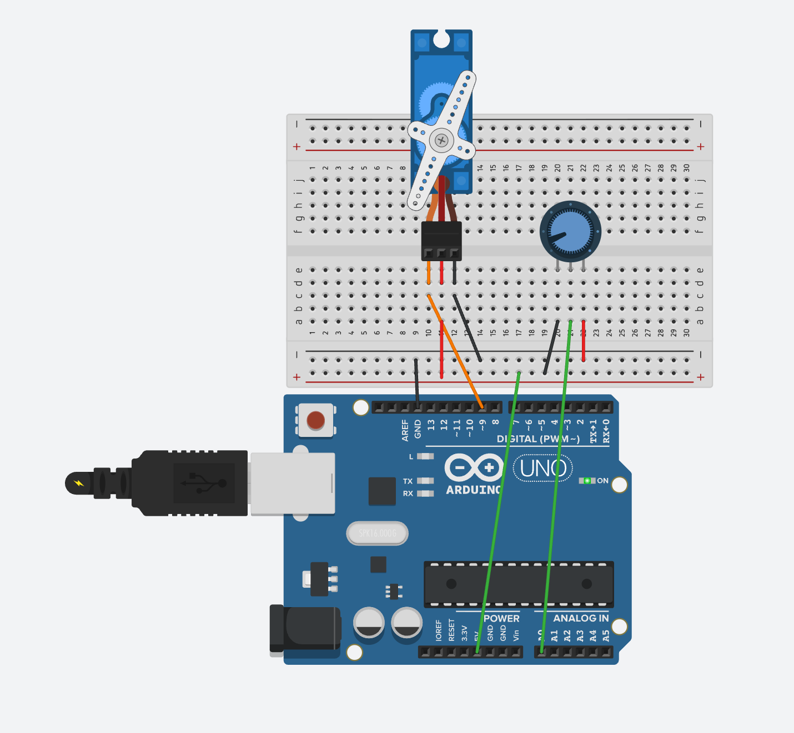
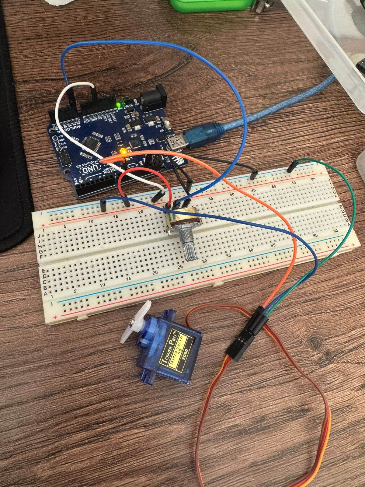
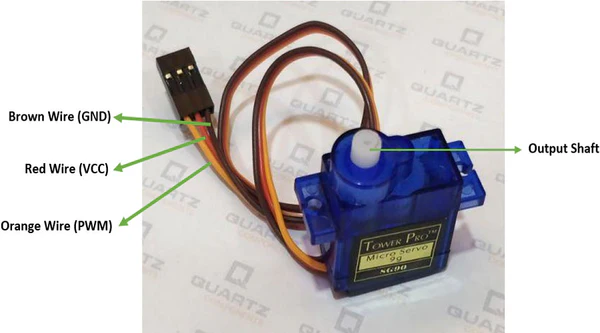

# Servo Motor Control with Potentiometer

Control a servo motor position using a potentiometer. Rotate the potentiometer to move the servo arm to different angles (0-180 degrees). This project demonstrates how to use libraries, control actuators, and combine analog input with physical movement.

## 📋 Project Description

This project allows you to control a servo motor's position by rotating a potentiometer. As you turn the potentiometer, the servo arm moves smoothly to different angles. This demonstrates the connection between analog input (reading sensor values) and actuator control (moving physical objects).

**Difficulty Level:** Beginner  
**Learning Objectives:**
- Understanding servo motors and actuators
- Using Arduino libraries (`#include <Servo.h>`)
- Controlling servo position with `servo.write()`
- Combining analog input with actuator output
- Mapping sensor values to actuator positions
- Understanding degrees of rotation (0-180°)

## 🔧 Components Required

- **Arduino Board** (Uno, Nano, Mega, or compatible)
- **USB Cable** (to connect Arduino to computer)
- **Servo Motor** (SG90 or compatible, 5V servo)
- **Potentiometer** (10kΩ recommended, but any value works)
- **Breadboard** (for easy connections)
- **Jumper Wires** (for connections)
- **External Power Supply** (optional, for larger servos or multiple servos)

## 🔌 Circuit Connections

**Circuit Connections:**

```
Servo Motor Circuit:
  Servo Red Wire (VCC) → 5V (or external 5V power supply)
  Servo Black/Brown Wire (GND) → GND
  Servo Orange/Yellow Wire (Signal) → Pin 9 (PWM)

Potentiometer Circuit:
  Potentiometer Pin 1 (left) → 5V
  Potentiometer Pin 2 (middle/wiper) → Pin A0 (analog input)
  Potentiometer Pin 3 (right) → GND
```

**Visual Connection Guide:**
```
Arduino Board:
    Pin 9 (~) ────────────────────────[Servo Signal (Orange/Yellow)]
    5V ───────────────────────────────[Servo VCC (Red)]
    GND ──────────────────────────────[Servo GND (Black/Brown)]
    
    5V ────────────────────────────[Pot Pin 1]
    Pin A0 ────────────────────────[Pot Pin 2 (wiper)]
    GND ───────────────────────────[Pot Pin 3]
```

### Circuit Diagrams

**Tinkercad Simulation:**
https://www.tinkercad.com/things/gH115VVy59e-7-servo-motor-potentiometer



**Real Circuit Photo:**


**Important Notes:**
- **Servo has 3 wires:** Red (VCC/5V), Black/Brown (GND), Orange/Yellow (Signal)
- **Signal wire** connects to PWM-capable pin (marked with ~ on Arduino Uno)
- **VCC wire** can connect to Arduino 5V for small servos (SG90)
- **For larger servos or multiple servos:** Use external 5V power supply
- Potentiometer pin 1 connects to 5V (power)
- Potentiometer pin 2 (wiper/middle) connects to analog pin A0
- Potentiometer pin 3 connects to GND (ground)
- Always connect GND of external power supply to Arduino GND if using external power

### Servo Motor Wire Colors



**Standard Servo (SG90) Wire Colors:**
- **Red** = VCC (Power, 5V)
- **Black or Brown** = GND (Ground)
- **Orange or Yellow** = Signal (Control pin, PWM)

*Note: Some servos may have different wire colors. Check your servo's documentation.*

## 💻 Code Explanation

### Key Concepts

**Servo Motors:**
- Servo motors are actuators that can rotate to specific angles
- Standard servos can rotate from 0° to 180°
- Controlled using PWM signals (pulse width modulation)
- Position is set by pulse width, not voltage level
- Require continuous power (not just pulses)

**Arduino Libraries:**
- Libraries extend Arduino functionality with pre-written code
- `#include <Servo.h>` adds servo control functions
- Libraries must be included at the top of the code
- Servo library handles PWM timing automatically

**Servo Control:**
- `servo.write(angle)` sets servo position (0-180 degrees)
- `servo.attach(pin)` connects servo to a pin
- Servo library uses PWM-capable pins
- One servo per pin (can use multiple servos on different pins)

### Key Functions

**`#include <Servo.h>`**
- Includes the Servo library
- Must be at the top of the code
- Provides servo control functions

**`Servo myServo;`**
- Creates a servo object
- `myServo` is the name we give to this servo
- Can create multiple servo objects for multiple servos

**`myServo.attach(SERVO_PIN)`**
- Connects the servo to a specific pin
- Must be called in `setup()`
- Pin must be PWM-capable (marked with ~ on Arduino Uno)

**`myServo.write(servoAngle)`**
- Sets the servo position
- Parameter: angle in degrees (0-180)
- 0° = fully counterclockwise
- 90° = center position
- 180° = fully clockwise

**`analogRead(POTENTIOMETER_PIN)`**
- Reads potentiometer value (0-1023)
- Used to get input for servo position

**`map(potValue, 0, 1023, 0, 180)`**
- Maps potentiometer range (0-1023) to servo angle range (0-180)
- Converts sensor value to actuator position

### Program Flow

1. **`setup()`** - Runs once when Arduino starts:
   - Attaches servo to pin 9
   - Initializes serial communication

2. **`loop()`** - Runs continuously:
   - Read potentiometer value (0-1023) using `analogRead()`
   - Map the value to servo angle (0-180 degrees) using `map()`
   - Set servo position using `servo.write()`
   - Print values to Serial Monitor
   - Small delay for smooth movement
   - Repeat

**Value Flow:**
```
Potentiometer Rotation
    ↓
Voltage Change (0V-5V)
    ↓
analogRead() → 0-1023
    ↓
map() → 0-180 degrees
    ↓
servo.write() → Servo Position
```

## 🚀 Usage Instructions

### Step 1: Build the Circuit

1. **Connect Servo Motor:**
   - Red wire (VCC) → 5V
   - Black/Brown wire (GND) → GND
   - Orange/Yellow wire (Signal) → Pin 9

2. **Connect Potentiometer:**
   - Potentiometer pin 1 (left) → 5V
   - Potentiometer pin 2 (middle/wiper) → Pin A0
   - Potentiometer pin 3 (right) → GND

**Important:** 
- For small servos (SG90), Arduino 5V is usually sufficient
- For larger servos or multiple servos, use external 5V power supply
- If using external power, connect its GND to Arduino GND

### Step 2: Open and Upload Code

1. Open Arduino IDE
2. Open the file `servo_motor.ino` from this folder
3. Connect your Arduino board
4. Select the correct board and port in Arduino IDE
5. Click **Upload** button

**Note:** The Servo library is included with Arduino IDE, so no additional installation is needed.

### Step 3: Test the Circuit

1. After uploading, open Serial Monitor (9600 baud)
2. Rotate the potentiometer clockwise - servo should move toward 180°
3. Rotate the potentiometer counterclockwise - servo should move toward 0°
4. Watch Serial Monitor to see potentiometer and angle values
5. Servo position should change smoothly in real-time

## 🔍 Expected Behavior

- Rotating potentiometer clockwise increases servo angle (toward 180°)
- Rotating potentiometer counterclockwise decreases servo angle (toward 0°)
- Servo position changes smoothly and in real-time
- Serial Monitor shows potentiometer values (0-1023) and servo angles (0-180°)
- At minimum rotation: Servo at 0° (fully counterclockwise)
- At maximum rotation: Servo at 180° (fully clockwise)
- Smooth transition between all positions

## 🛠️ Troubleshooting

### Servo Doesn't Move

**Problem:** Servo doesn't move when potentiometer is rotated
- **Solution:** Check servo connections - Red to 5V, Black/Brown to GND, Orange/Yellow to pin 9
- **Solution:** Verify potentiometer connections - wiper (middle pin) must connect to A0
- **Solution:** Check that pin 9 is being used (check `SERVO_PIN` constant)
- **Solution:** Make sure servo is properly attached: `myServo.attach(SERVO_PIN)`
- **Solution:** Test servo by uploading a simple test: `myServo.write(90);` in setup()

### Servo Moves Erratically or Jitters

**Problem:** Servo moves in jumps or jitters
- **Solution:** Add external 5V power supply - Arduino 5V may not provide enough current
- **Solution:** Connect external power GND to Arduino GND (important!)
- **Solution:** Check for loose connections
- **Solution:** Increase delay value (try `delay(20)` or `delay(30)`)
- **Solution:** Some servos need more power - use external supply

### Servo Doesn't Reach Full Range

**Problem:** Servo doesn't reach 0° or 180°
- **Solution:** This is normal - servos have mechanical limits
- **Solution:** Adjust map range: `map(potValue, 0, 1023, 10, 170)` to avoid extremes
- **Solution:** Check potentiometer range with Serial Monitor
- **Solution:** Some servos have different ranges - adjust accordingly

### Servo Moves in Wrong Direction

**Problem:** Servo moves opposite to potentiometer rotation
- **Solution:** Invert the map: `map(potValue, 0, 1023, 180, 0)`
- **Solution:** Or swap potentiometer connections (pin 1 and pin 3)

### Arduino Resets or Servo Stops Working

**Problem:** Arduino resets when servo moves
- **Solution:** Servo is drawing too much current - use external 5V power supply
- **Solution:** Connect external power supply GND to Arduino GND
- **Solution:** Disconnect servo VCC from Arduino 5V when using external supply
- **Solution:** Use a capacitor (100-1000µF) across power supply

### Serial Monitor Shows Nothing

**Problem:** No values in Serial Monitor
- **Solution:** Make sure Serial Monitor is set to 9600 baud
- **Solution:** Click Serial Monitor icon after uploading code
- **Solution:** Verify serial communication is initialized in `setup()`

### Servo Library Error

**Problem:** Compilation error about Servo library
- **Solution:** Servo library is included with Arduino IDE - should work automatically
- **Solution:** Try restarting Arduino IDE
- **Solution:** Check Arduino IDE version (should be recent)
- **Solution:** Verify `#include <Servo.h>` is at the top of the code

## 🎓 Learning Concepts

This project teaches:
- **Actuators:** Devices that create physical movement (servos, motors)
- **Arduino Libraries:** Using pre-written code to extend functionality
- **Servo Control:** Controlling position with `servo.write()`
- **PWM for Servos:** How servos use PWM signals for position control
- **Analog to Actuator:** Connecting sensor input to physical movement
- **Position Control:** Precise angular positioning (0-180 degrees)
- **Real-time Control:** Continuous sensor-to-actuator feedback

## 🔄 Next Steps

After mastering this project, try:
- **Servo Sweep:** Automatic back-and-forth movement without potentiometer
- **Multiple Servos:** Control multiple servos with different potentiometers
- **Servo with Buttons:** Use buttons to move servo left/right
- **Servo Arm Control:** Build a robotic arm with multiple servos
- **Servo with Sensor:** Control servo based on sensor readings (light, distance, etc.)
- **Servo Positioning System:** Create precise positioning systems
- **Servo with Feedback:** Use servo with position feedback (encoder)

## 📝 Notes

- This project uses **Pin 9** for servo control (must be PWM-capable) and **Pin A0** for potentiometer
- Servo library uses PWM-capable pins (marked with ~ on Arduino Uno: 3, 5, 6, 9, 10, 11)
- Standard servos rotate 0-180 degrees
- Small servos (SG90) can run on Arduino 5V
- Larger servos need external 5V power supply
- Always connect external power GND to Arduino GND
- `delay(15)` provides smooth servo movement
- You can change pins by modifying `SERVO_PIN` and `POTENTIOMETER_PIN` constants
- Servo library handles PWM timing automatically

## 🔬 Experiment Ideas

1. **Change Servo Range:**
   - Limit range: `map(potValue, 0, 1023, 30, 150)`
   - Avoid mechanical limits

2. **Reverse Direction:**
   - Invert map: `map(potValue, 0, 1023, 180, 0)`
   - Clockwise = 0°, counterclockwise = 180°

3. **Servo Sweep Mode:**
   - Remove potentiometer
   - Make servo sweep automatically 0° to 180° and back

4. **Multiple Servos:**
   - Add more servos on different pins
   - Control each with its own potentiometer

5. **Servo with Buttons:**
   - Replace potentiometer with two buttons
   - One button moves left, other moves right

6. **Speed Control:**
   - Add delay based on movement distance
   - Slower movement for larger angle changes

## 📚 Related Resources

- [Arduino Servo Library](https://www.arduino.cc/reference/en/libraries/servo/)
- [Arduino Servo Tutorial](https://www.arduino.cc/en/Tutorial/Sweep)
- [Servo Motor Basics](https://www.arduino.cc/en/Tutorial/Knob)
- [Arduino Libraries Guide](https://www.arduino.cc/en/guide/libraries)
- [PWM and Servos](https://www.arduino.cc/en/Tutorial/SecretsOfArduinoPWM)

---

**Author:** XergioAleX  
**Date:** 2025  
**Version:** 1.0  
**Project:** Servo Motor Control with Potentiometer

