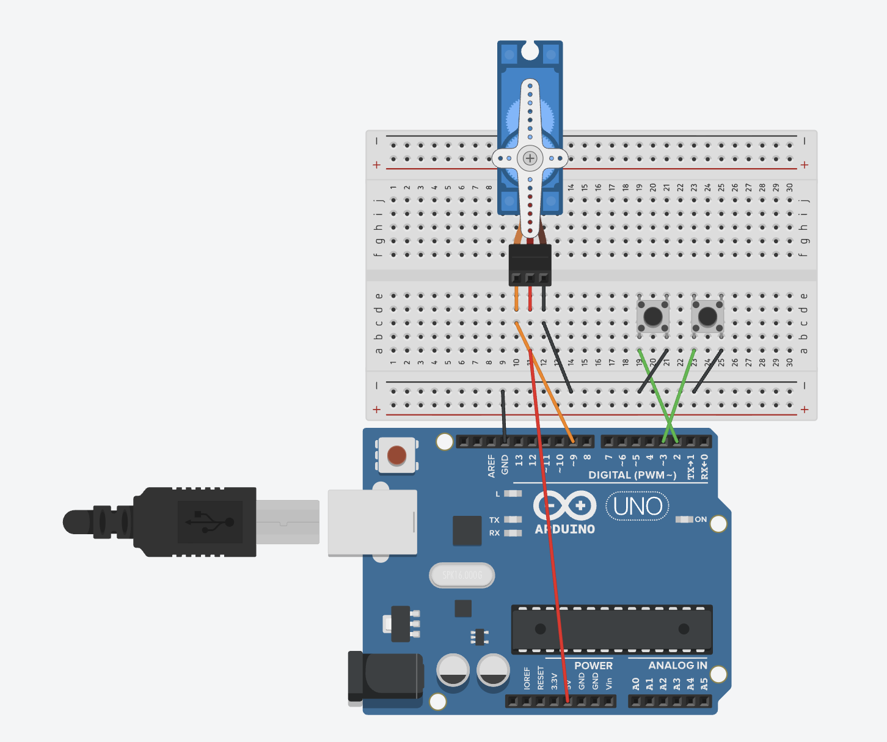
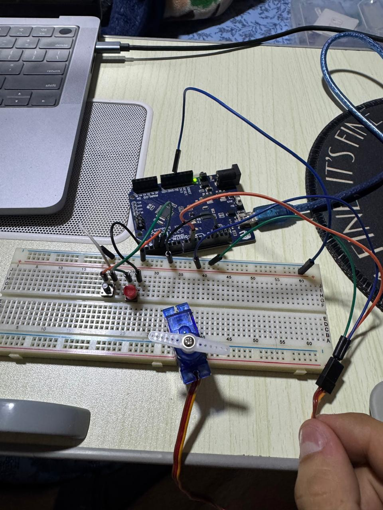

# Servo Motor Control with Buttons

Control a servo motor position using push buttons. Press the left button to move the servo counterclockwise, and the right button to move it clockwise. This project demonstrates digital input control of actuators and button-based positioning.

## 📋 Project Description

This project allows you to control a servo motor's position using two push buttons. Each button press moves the servo by a fixed amount (5 degrees). The left button moves the servo toward 0°, and the right button moves it toward 180°. This demonstrates how to use digital inputs (buttons) to control actuators (servos).

**Difficulty Level:** Beginner  
**Learning Objectives:**
- Controlling servo motors with digital inputs
- Using multiple buttons for control
- Edge detection for button presses
- Incremental position control
- Setting angle limits (0-180°)
- Combining digital input with actuator output

## 🔧 Components Required

- **Arduino Board** (Uno, Nano, Mega, or compatible)
- **USB Cable** (to connect Arduino to computer)
- **Servo Motor** (SG90 or compatible, 5V servo)
- **Push Buttons** (2x momentary push buttons)
- **Breadboard** (for easy connections)
- **Jumper Wires** (for connections)
- **External Power Supply** (optional, for larger servos)

## 🔌 Circuit Connections

**Circuit Connections:**

```
Servo Motor Circuit:
  Servo Red Wire (VCC) → 5V (or external 5V power supply)
  Servo Black/Brown Wire (GND) → GND
  Servo Orange/Yellow Wire (Signal) → Pin 9 (PWM)

Button Circuit:
  Left Button Pin 1 → Pin 2
  Left Button Pin 2 → GND
  Right Button Pin 1 → Pin 3
  Right Button Pin 2 → GND
```

**Visual Connection Guide:**
```
Arduino Board:
    Pin 9 (~) ────────────────────────[Servo Signal (Orange/Yellow)]
    5V ───────────────────────────────[Servo VCC (Red)]
    GND ──────────────────────────────[Servo GND (Black/Brown)]
    
    Pin 2 ────────────────────────────[Left Button Pin 1]
    GND ─────────────────────────────[Left Button Pin 2]
    
    Pin 3 ───────────────────────────[Right Button Pin 1]
    GND ─────────────────────────────[Right Button Pin 2]
```

### Circuit Diagrams

**Tinkercad Simulation:**
https://www.tinkercad.com/things/3hljdn1Jxhi-8-servo-motor-buttons



**Real Circuit Photo:**


**Important Notes:**
- **Servo has 3 wires:** Red (VCC/5V), Black/Brown (GND), Orange/Yellow (Signal)
- **Signal wire** connects to PWM-capable pin (marked with ~ on Arduino Uno)
- **Buttons** use internal pull-up resistors (`INPUT_PULLUP`)
- When button is NOT pressed: pin reads HIGH (due to pull-up)
- When button IS pressed: pin reads LOW (connected to GND)
- Each button press moves servo by 5 degrees (adjustable with `ANGLE_STEP`)

## 💻 Code Explanation

### Key Concepts

**Button Control:**
- Two buttons control servo movement
- Left button decreases angle (moves toward 0°)
- Right button increases angle (moves toward 180°)
- Edge detection ensures one movement per button press
- Angle limits prevent servo from going beyond 0-180°

**Incremental Control:**
- Servo moves in steps (5 degrees per press)
- Position is tracked in `servoAngle` variable
- Limits are enforced to stay within 0-180° range

**Edge Detection:**
- Detects the moment button is pressed (not while held)
- Prevents multiple movements from a single press
- Uses `lastButtonState` to compare previous state

### Key Functions

**`myServo.write(servoAngle)`**
- Sets servo position to specified angle
- Angle range: 0-180 degrees
- Called after each button press

**`digitalRead(BUTTON_PIN)`**
- Reads button state (HIGH or LOW)
- Returns LOW when button is pressed (due to pull-up)

**Edge Detection Logic:**
```cpp
if (buttonState == LOW && lastButtonState == HIGH)
```
- Detects button press moment (transition from HIGH to LOW)
- Only triggers once per press

**Angle Limiting:**
```cpp
if (servoAngle < MIN_ANGLE) servoAngle = MIN_ANGLE;
if (servoAngle > MAX_ANGLE) servoAngle = MAX_ANGLE;
```
- Prevents servo from going beyond 0-180° range

### Program Flow

1. **`setup()`** - Runs once when Arduino starts:
   - Attaches servo to pin 9
   - Configures buttons as inputs with pull-up resistors
   - Sets initial servo position to 90° (center)
   - Initializes serial communication

2. **`loop()`** - Runs continuously:
   - Read both button states
   - Check if left button was pressed (edge detection)
   - If pressed, decrease angle by 5° and update servo
   - Check if right button was pressed (edge detection)
   - If pressed, increase angle by 5° and update servo
   - Save button states for next iteration
   - Repeat

## 🚀 Usage Instructions

### Step 1: Build the Circuit

1. **Connect Servo Motor:**
   - Red wire (VCC) → 5V
   - Black/Brown wire (GND) → GND
   - Orange/Yellow wire (Signal) → Pin 9

2. **Connect Buttons:**
   - Left Button: Pin 1 → Pin 2, Pin 2 → GND
   - Right Button: Pin 1 → Pin 3, Pin 2 → GND

**Important:** 
- Buttons use internal pull-up resistors (no external resistors needed)
- For larger servos, use external 5V power supply

### Step 2: Open and Upload Code

1. Open Arduino IDE
2. Open the file `servo_motor_button.ino` from this folder
3. Connect your Arduino board
4. Select the correct board and port in Arduino IDE
5. Click **Upload** button

### Step 3: Test the Circuit

1. After uploading, open Serial Monitor (9600 baud)
2. Press LEFT button - servo should move counterclockwise (toward 0°)
3. Press RIGHT button - servo should move clockwise (toward 180°)
4. Watch Serial Monitor to see angle values
5. Servo position changes by 5 degrees per button press

## 🔍 Expected Behavior

- Pressing LEFT button moves servo counterclockwise (decreases angle)
- Pressing RIGHT button moves servo clockwise (increases angle)
- Each button press moves servo by 5 degrees
- Servo stops at limits (0° and 180°)
- Serial Monitor shows current angle after each button press
- Button must be released and pressed again for next movement

## 🛠️ Troubleshooting

### Servo Doesn't Move

**Problem:** Servo doesn't respond to button presses
- **Solution:** Check servo connections - Red to 5V, Black/Brown to GND, Orange/Yellow to pin 9
- **Solution:** Verify button connections - one terminal to pin, other to GND
- **Solution:** Check that pins 2 and 3 are being used (check button pin constants)
- **Solution:** Test buttons individually with Serial Monitor

### Servo Moves Too Fast or Too Slow

**Problem:** Servo movement speed is not ideal
- **Solution:** Adjust `ANGLE_STEP` value - smaller = slower movement, larger = faster
- **Solution:** Try `ANGLE_STEP = 1` for fine control or `ANGLE_STEP = 10` for faster movement

### Buttons Don't Work

**Problem:** Button presses don't trigger servo movement
- **Solution:** Check button connections - one terminal to pin, other to GND
- **Solution:** Verify buttons are momentary push buttons (not toggle switches)
- **Solution:** Check Serial Monitor to see if button presses are detected
- **Solution:** Test buttons by connecting directly to 5V and GND

### Servo Reaches Limits Too Quickly

**Problem:** Servo hits 0° or 180° too fast
- **Solution:** Reduce `ANGLE_STEP` value (e.g., from 5 to 2 or 1)
- **Solution:** This gives more precise control and more button presses before reaching limits

### Multiple Movements Per Press

**Problem:** Servo moves multiple times with one button press
- **Solution:** This is button bounce - the code includes 50ms delay to minimize this
- **Solution:** If problem persists, increase delay value (e.g., `delay(100)`)
- **Solution:** Check button quality - some buttons have more bounce than others

## 🎓 Learning Concepts

This project teaches:
- **Digital Input Control:** Using buttons to control actuators
- **Multiple Inputs:** Handling multiple buttons simultaneously
- **Edge Detection:** Detecting button press events (not held state)
- **Incremental Control:** Step-by-step position adjustment
- **Angle Limiting:** Preventing out-of-range positions
- **Button Debouncing:** Handling mechanical switch bounce
- **State Tracking:** Maintaining servo position in variable

## 🔄 Next Steps

After mastering this project, try:
- **Variable Speed:** Change step size based on how long button is held
- **Center Button:** Add a third button to return servo to center (90°)
- **Multiple Servos:** Control multiple servos with different button sets
- **Preset Positions:** Add buttons for specific angles (0°, 90°, 180°)
- **Smoother Movement:** Add acceleration/deceleration for smoother motion
- **LCD Display:** Show current angle on LCD display

## 📝 Notes

- This project uses **Pin 9** for servo and **Pins 2, 3** for buttons
- Servo starts at center position (90 degrees)
- Each button press moves servo by 5 degrees (adjustable)
- Angle limits: 0° (minimum) to 180° (maximum)
- Buttons use internal pull-up resistors (`INPUT_PULLUP`)
- Button reads LOW when pressed (due to pull-up configuration)
- You can change pins by modifying pin constants
- Adjust `ANGLE_STEP` to change movement increment

## 🔬 Experiment Ideas

1. **Change Step Size:**
   - Modify `ANGLE_STEP` (try 1, 2, 10, 15)
   - Smaller = more precise, larger = faster movement

2. **Add Center Button:**
   - Add third button that sets servo to 90°
   - Useful for returning to center position

3. **Variable Speed:**
   - Hold button longer = move faster
   - Implement acceleration based on hold time

4. **Preset Positions:**
   - Add buttons for specific angles
   - One button = 0°, another = 90°, another = 180°

5. **Smooth Movement:**
   - Instead of instant movement, gradually move to target
   - Add small delays between angle changes

## 📚 Related Resources

- [Arduino Servo Library](https://www.arduino.cc/reference/en/libraries/servo/)
- [Arduino Digital Input](https://www.arduino.cc/reference/en/language/functions/digital-io/digitalread/)
- [Arduino Button Tutorial](https://www.arduino.cc/en/Tutorial/Button)
- [Servo Motor Basics](https://www.arduino.cc/en/Tutorial/Knob)

---

**Author:** XergioAleX  
**Date:** 2025  
**Version:** 1.0  
**Project:** Servo Motor Control with Buttons

