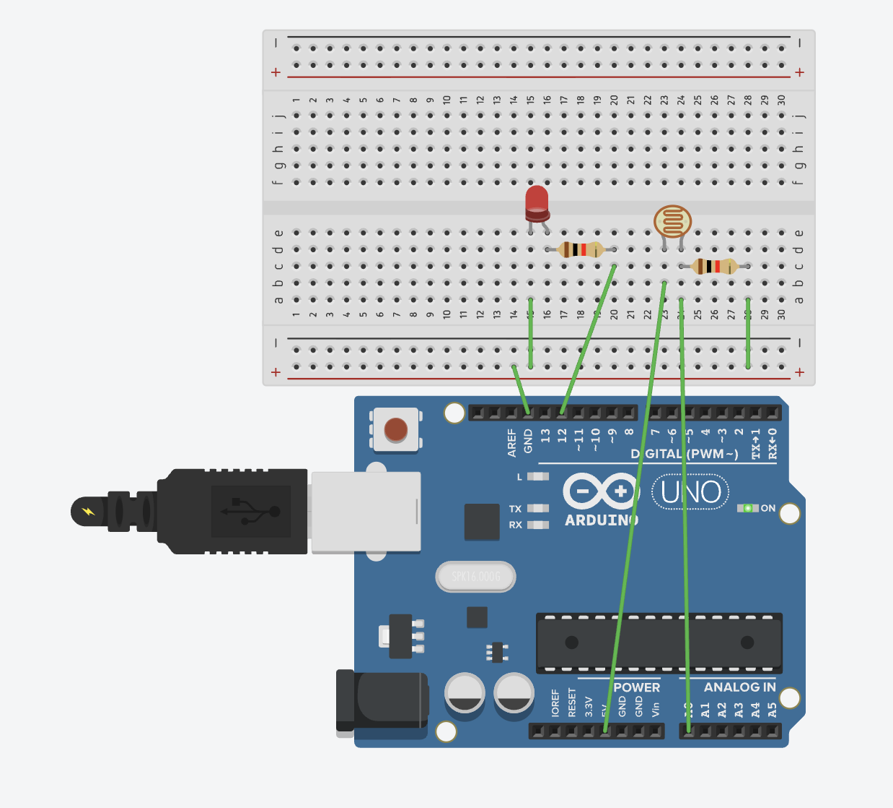

# LDR Light Sensor - Automatic LED Control

Turn on an LED automatically when it gets dark using an LDR (Light Dependent Resistor). This project demonstrates how to use real-world sensors to create automatic control systems based on environmental conditions.

## 📋 Project Description

This project uses an LDR (Light Dependent Resistor) to detect light levels. When the environment gets dark (LDR reading exceeds a threshold), the LED automatically turns on. When it's bright, the LED turns off. This demonstrates automatic control based on sensor readings and real-world applications like automatic night lights.

**Difficulty Level:** Beginner  
**Learning Objectives:**
- Understanding LDR (Light Dependent Resistor) sensors
- Reading analog sensor values from the environment
- Implementing threshold-based control logic
- Creating automatic control systems
- Using sensors to respond to environmental conditions
- Understanding voltage dividers with sensors

## 🔧 Components Required

**Option 1: Basic LDR (Manual Circuit)**
- **Arduino Board** (Uno, Nano, Mega, or compatible)
- **USB Cable** (to connect Arduino to computer)
- **LED** (any color)
- **Resistor** (330Ω for LED)
- **LDR** (Light Dependent Resistor, photoresistor)
- **Resistor** (10kΩ for voltage divider with LDR)
- **Breadboard** (for easy connections)
- **Jumper Wires** (for connections)

**Option 2: LDR Module (Recommended - Easier)**
- **Arduino Board** (Uno, Nano, Mega, or compatible)
- **USB Cable** (to connect Arduino to computer)
- **LED** (any color)
- **Resistor** (330Ω for LED)
- **LDR Module** (with built-in comparator and potentiometer)
- **Breadboard** (for easy connections)
- **Jumper Wires** (for connections)

*Note: This project supports both options. The LDR Module is easier to use as it has built-in circuitry.*

## 🔌 Circuit Connections

### Option 1: Basic LDR Circuit

**Circuit Connections:**

```
LED Circuit:
  LED Anode (long leg) → Resistor (330Ω) → Pin 12
  LED Cathode (short leg) → GND

LDR Voltage Divider Circuit:
  5V → LDR → Pin A0 → Resistor (10kΩ) → GND
```

**Visual Connection Guide:**
```
Arduino Board:
    Pin 12 ────[330Ω Resistor]───[LED Anode (+)]
    GND ─────────────────────────[LED Cathode (-)]
    
    5V ────[LDR]───[Pin A0]───[10kΩ Resistor]───GND
```

**How the Voltage Divider Works (Step by Step):**

The LDR and 10kΩ resistor form a **voltage divider circuit**. Here's how to connect it:

1. **Connect one leg of LDR to 5V** (power)
2. **Connect the other leg of LDR to Pin A0** (this is the middle point)
3. **Connect Pin A0 to one leg of 10kΩ resistor** (same point as LDR)
4. **Connect the other leg of 10kΩ resistor to GND** (ground)

**Physical Connection:**
```
5V (Arduino)
    │
    ├───[LDR]───┐
                │
              Pin A0 (Arduino reads voltage here)
                │
    ┌───────────┘
    │
[10kΩ Resistor]
    │
    └─── GND (Arduino)
```

**How It Works:**
- The **LDR** and **10kΩ resistor** are connected in **series** (one after the other)
- Pin A0 is connected **between** them (at the junction point)
- When **bright**: LDR has LOW resistance → Most voltage drops across 10kΩ → A0 reads LOW voltage
- When **dark**: LDR has HIGH resistance → Most voltage drops across LDR → A0 reads HIGH voltage
- Arduino reads the voltage at Pin A0 (0-5V = 0-1023 in digital value)

### Option 2: LDR Module (Recommended)

**Circuit Connections:**

```
LED Circuit:
  LED Anode (long leg) → Resistor (330Ω) → Pin 12
  LED Cathode (short leg) → GND

LDR Module Connections:
  Module VCC → 5V
  Module GND → GND
  Module DO (Digital Output) → Pin 2
  Module AO (Analog Output) → Not used in this version (optional)
```

**Visual Connection Guide:**
```
Arduino Board:
    Pin 12 ────[330Ω Resistor]───[LED Anode (+)]
    GND ─────────────────────────[LED Cathode (-)]
    
    5V ───────────────────────────[Module VCC]
    GND ──────────────────────────[Module GND]
    Pin 2 ────────────────────────[Module DO]
```

**LDR Module Pinout:**
- **VCC** - Power (5V)
- **GND** - Ground
- **DO** - Digital Output (LOW when dark, HIGH when bright)
- **AO** - Analog Output (0-1023, optional for analog reading)

**Module Features:**
- Built-in comparator (LM393)
- Potentiometer for sensitivity adjustment
- LED indicator on module
- Digital and analog outputs

### Circuit Diagrams

**Tinkercad Simulation:**
https://www.tinkercad.com/things/aMCXe6Wqwjh-10-ldr-module-with-led



**Real Circuit Photo:**


**Important Notes:**

**For Basic LDR:**
- The LED anode (positive, long leg) connects to the resistor, then to pin 12
- The LED cathode (negative, short leg) connects directly to GND
- **LDR forms a voltage divider** with the 10kΩ resistor
- LDR connects between 5V and analog pin A0
- 10kΩ resistor connects between A0 and GND
- When bright: LDR resistance is LOW → A0 reads LOW voltage
- When dark: LDR resistance is HIGH → A0 reads HIGH voltage
- Always use a current-limiting resistor (220Ω-330Ω) with LEDs

**For LDR Module:**
- Module has built-in voltage divider and comparator
- Use **DO (Digital Output)** pin for simple on/off control
- Adjust module's potentiometer to set sensitivity threshold
- DO pin: LOW = dark detected, HIGH = bright
- Module LED indicator shows when threshold is crossed
- No need to build voltage divider circuit manually
- Use `ldr_led_module.ino` code for module version

### LDR (Light Dependent Resistor) Basics

**How LDR Works:**
- LDR is a photoresistor - its resistance changes with light
- **Bright light:** Low resistance (few hundred ohms)
- **Dark:** High resistance (several megaohms)
- Used in voltage divider circuit to create variable voltage

**Voltage Divider Principle:**
- LDR and fixed resistor (10kΩ) form a voltage divider
- Voltage at A0 depends on ratio of resistances
- More light = lower LDR resistance = lower voltage at A0
- Less light = higher LDR resistance = higher voltage at A0

## 💻 Code Explanation

**Two Code Versions Available:**
- **`ldr_led.ino`** - For basic LDR circuit (uses analog input and threshold logic)
- **`ldr_led_module.ino`** - For LDR Module (uses digital output, simpler code)

### Key Concepts

**Basic LDR (ldr_led.ino):**

**LDR Reading:**
- `analogRead(LDR_PIN)` returns 0-1023
- **Lower values (0-300):** Very bright environment
- **Medium values (300-700):** Normal lighting
- **Higher values (700-1023):** Dark environment

**Threshold-Based Control:**
- Compare LDR reading to threshold value
- If reading > threshold → Dark → Turn LED ON
- If reading ≤ threshold → Bright → Turn LED OFF
- Threshold is adjustable (`DARK_THRESHOLD` constant)

**LDR Module (ldr_led_module.ino):**

**Digital Output:**
- Module's DO pin provides digital signal (LOW/HIGH)
- LOW = dark detected (below threshold)
- HIGH = bright (above threshold)
- Threshold adjusted via module's potentiometer
- No need for threshold logic in code - module handles it

**Automatic Control:**
- No user input needed
- System responds automatically to light changes
- Continuous monitoring of light levels

### Key Functions

**`analogRead(LDR_PIN)`**
- Reads the analog value from pin A0
- Returns a value from 0 to 1023
- Lower = brighter, Higher = darker
- No `pinMode()` needed for analog pins (they're inputs by default)

**Threshold Logic:**
```cpp
if (ldrValue > DARK_THRESHOLD) {
  // Dark - turn LED ON
} else {
  // Bright - turn LED OFF
}
```
- Simple conditional logic
- Adjustable threshold for sensitivity

**`digitalWrite(LED_PIN, HIGH/LOW)`**
- Controls LED based on light condition
- HIGH = LED ON (when dark)
- LOW = LED OFF (when bright)

### Program Flow

1. **`setup()`** - Runs once when Arduino starts:
   - Configures pin 12 as output (LED)
   - Initializes serial communication
   - Prints threshold value for reference

2. **`loop()`** - Runs continuously:
   - Read LDR value using `analogRead()`
   - Compare value to threshold
   - If dark (value > threshold): Turn LED ON
   - If bright (value ≤ threshold): Turn LED OFF
   - Print status to Serial Monitor
   - Small delay for stability
   - Repeat

**Control Flow:**
```
Read LDR Value
    ↓
Compare to Threshold
    ↓
Dark? → LED ON
Bright? → LED OFF
    ↓
Repeat
```

## 🚀 Usage Instructions

### Option 1: Using Basic LDR

#### Step 1: Build the Circuit

1. **Connect LED to pin 12:**
   - LED anode → Resistor (330Ω) → Pin 12
   - LED cathode → GND

2. **Connect LDR Voltage Divider:**
   - 5V → LDR → Pin A0
   - Pin A0 → Resistor (10kΩ) → GND

**Important:** 
- LDR has no polarity - can be connected either way
- Make sure voltage divider is connected correctly
- 10kΩ resistor value can vary (5kΩ-20kΩ works)

#### Step 2: Open and Upload Code

1. Open Arduino IDE
2. Open the file `ldr_led.ino` from this folder
3. Connect your Arduino board
4. Select the correct board and port in Arduino IDE
5. Click **Upload** button

#### Step 3: Test the Circuit

1. After uploading, open Serial Monitor (9600 baud)
2. In normal light, LED should be OFF
3. Cover the LDR with your hand - LED should turn ON
4. Uncover the LDR - LED should turn OFF
5. Watch Serial Monitor to see LDR values and LED status
6. Adjust threshold if needed (see Troubleshooting)

---

### Option 2: Using LDR Module (Recommended)

#### Step 1: Build the Circuit

1. **Connect LED to pin 12:**
   - LED anode → Resistor (330Ω) → Pin 12
   - LED cathode → GND

2. **Connect LDR Module:**
   - Module VCC → 5V
   - Module GND → GND
   - Module DO → Pin 2

**Important:** 
- Module has built-in circuitry - no need for external resistors
- Adjust module's potentiometer to set sensitivity
- Module LED indicator shows when threshold is crossed

#### Step 2: Open and Upload Code

1. Open Arduino IDE
2. Open the file `ldr_led_module.ino` from this folder
3. Connect your Arduino board
4. Select the correct board and port in Arduino IDE
5. Click **Upload** button

#### Step 3: Test the Circuit

1. After uploading, open Serial Monitor (9600 baud)
2. In normal light, LED should be OFF
3. Cover the LDR module with your hand - LED should turn ON
4. Uncover the module - LED should turn OFF
5. Adjust module's potentiometer to fine-tune sensitivity
6. Watch Serial Monitor to see LED status

## 🔍 Expected Behavior

- **In bright light:** LED is OFF, Serial shows "Bright" and LDR value
- **When dark (cover LDR):** LED turns ON, Serial shows "Dark detected" and LDR value
- **Automatic response:** LED responds immediately to light changes
- **Serial Monitor:** Shows LDR values and current state (Bright/Dark)
- **Smooth operation:** LED toggles smoothly between ON and OFF states

## 🛠️ Troubleshooting

### LED Doesn't Turn On When Dark

**Problem:** LED never turns on, even when covering LDR
- **Solution:** Check LDR connections - voltage divider must be correct
- **Solution:** Verify 10kΩ resistor is connected between A0 and GND
- **Solution:** Lower the threshold value (try `DARK_THRESHOLD = 300`)
- **Solution:** Check Serial Monitor to see actual LDR values
- **Solution:** Test LDR by reading values in different light conditions

### LED Stays On All the Time

**Problem:** LED is always on, even in bright light
- **Solution:** Increase the threshold value (try `DARK_THRESHOLD = 700`)
- **Solution:** Check LDR connections - may be reversed or incorrect
- **Solution:** Check Serial Monitor to see LDR values
- **Solution:** LDR may be damaged - try a different one

### LED Doesn't Respond to Light Changes

**Problem:** LED doesn't change when covering/uncovering LDR
- **Solution:** Check all connections - voltage divider must be correct
- **Solution:** Verify LDR is working - test with multimeter
- **Solution:** Check Serial Monitor to see if values are changing
- **Solution:** Make sure LDR is exposed to light (not covered)

### Wrong Sensitivity

**Problem:** LED turns on/off at wrong light levels
- **Solution:** Adjust `DARK_THRESHOLD` value:
  - Too sensitive (turns on too early): Increase threshold (e.g., 600, 700)
  - Not sensitive enough (needs very dark): Decrease threshold (e.g., 300, 400)
- **Solution:** Test different threshold values and observe behavior
- **Solution:** Use Serial Monitor to find appropriate threshold for your environment

### LDR Values Don't Change

**Problem:** Serial Monitor shows same LDR value regardless of light
- **Solution:** Check voltage divider connections
- **Solution:** Verify LDR is working - test with multimeter
- **Solution:** Check that LDR is exposed to changing light
- **Solution:** Try a different LDR if current one is faulty

### Serial Monitor Shows Nothing

**Problem:** No values in Serial Monitor
- **Solution:** Make sure Serial Monitor is set to 9600 baud
- **Solution:** Click Serial Monitor icon after uploading code
- **Solution:** Verify serial communication is initialized in `setup()`

## 🎓 Learning Concepts

This project teaches:
- **LDR Sensors:** Light-dependent resistors and how they work
- **Voltage Dividers:** Using resistors to create variable voltage
- **Analog Sensors:** Reading real-world environmental values
- **Threshold Logic:** Using comparisons to make decisions
- **Automatic Control:** Creating systems that respond to environment
- **Sensor Calibration:** Adjusting thresholds for desired behavior

## 🔄 Next Steps

After mastering this project, try:
- **Variable Brightness:** Make LED brightness proportional to darkness
- **Multiple LEDs:** Control multiple LEDs based on light level
- **Hysteresis:** Add different thresholds for ON and OFF (prevents flickering)
- **RGB LED:** Change LED color based on light level
- **Servo Control:** Control servo position based on light
- **Data Logging:** Record light levels over time
- **Smart Home:** Integrate with home automation systems

## 📝 Notes

- This project uses **Pin 12** for LED and **Pin A0** for LDR
- LDR has no polarity - can be connected either direction
- Default threshold: 500 (adjustable based on your needs)
- 10kΩ resistor value can vary (5kΩ-20kΩ typically works)
- LDR readings: Lower = brighter, Higher = darker
- You can change pins by modifying `LED_PIN` and `LDR_PIN` constants
- Threshold adjustment is key to proper operation
- Test in your actual environment to find optimal threshold

## 🔬 Experiment Ideas

1. **Adjust Threshold:**
   - Try different `DARK_THRESHOLD` values (200, 400, 600, 800)
   - Find the value that works best in your environment

2. **Variable Brightness:**
   - Instead of ON/OFF, use PWM to control brightness
   - Darker = brighter LED, Brighter = dimmer LED

3. **Hysteresis (Prevent Flickering):**
   - Use different thresholds for ON and OFF
   - Turn ON at 600, Turn OFF at 400 (prevents rapid switching)

4. **Multiple LEDs:**
   - Add more LEDs that turn on at different light levels
   - Create a light level indicator

5. **Reverse Logic:**
   - Turn LED ON when bright, OFF when dark
   - Useful for daylight indicators

6. **Time-Based Control:**
   - Add time delay before turning on/off
   - Prevents rapid switching from shadows

## 📚 Related Resources

- [Arduino analogRead()](https://www.arduino.cc/reference/en/language/functions/analog-io/analogread/)
- [Arduino Analog Input Pins](https://www.arduino.cc/en/Tutorial/ReadAnalogVoltage)
- [Voltage Divider Tutorial](https://learn.sparkfun.com/tutorials/voltage-dividers)
- [LDR (Photoresistor) Basics](https://learn.adafruit.com/photocells)

---

**Author:** XergioAleX  
**Date:** 2025  
**Version:** 1.0  
**Project:** LDR Light Sensor - Automatic LED Control

