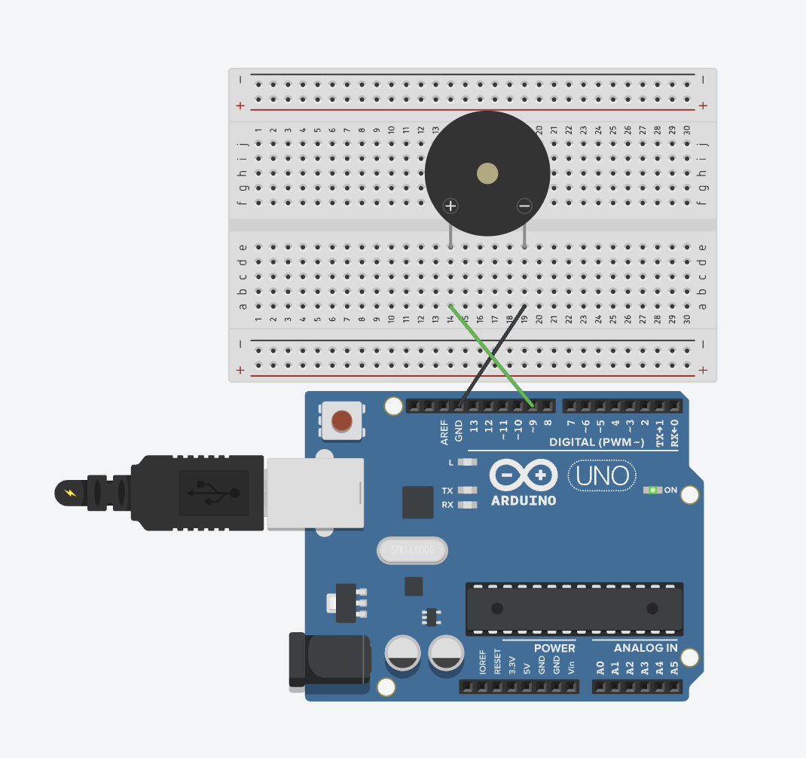
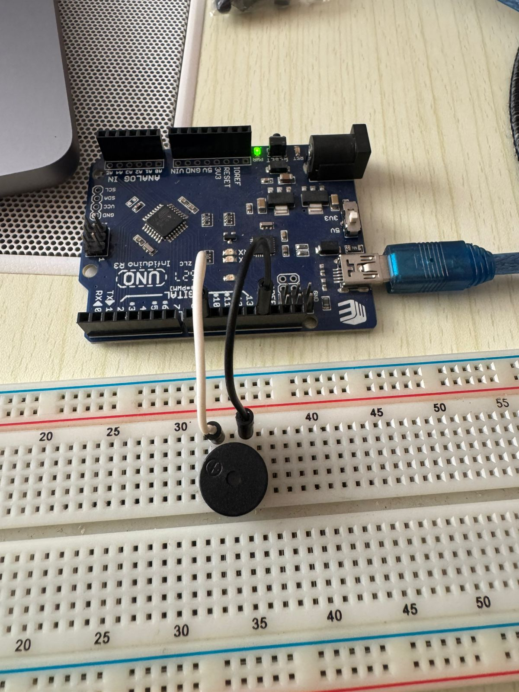

# Buzzer - Sound Generation

Generate sounds and melodies using a buzzer. This project includes three code examples: basic note playing, complete melody playback, and a famous video game melody. All use the same circuit, demonstrating different approaches to sound generation.

## 📋 Project Description

This project demonstrates sound generation with Arduino using a buzzer. Three code examples are provided:

1. **`buzzer_basic.ino`** - Plays individual notes one at a time. Demonstrates the basics of `tone()` and `noTone()` functions.

2. **`buzzer_melody.ino`** - Plays complete melodies using arrays. Demonstrates how to store melodies in arrays and play them with loops. Plays "Twinkle Twinkle Little Star".

3. **`buzzer_zelda.ino`** - Plays "Saria's Song" from The Legend of Zelda: Ocarina of Time. One of the most recognizable and beloved songs from the game, demonstrating extended note ranges and characteristic ascending/descending patterns.

All examples use the same circuit - only the code differs. Start with the basic example to understand fundamentals, then try the melody examples to see arrays in action.

**Difficulty Level:** Beginner  
**Learning Objectives:**
- Understanding sound generation with Arduino
- Using `tone()` and `noTone()` functions
- Musical note frequencies
- Playing individual notes (basic example)
- Creating melodies with arrays (melody example)
- Loops and arrays for music
- PWM for sound generation

## 🔧 Components Required

- **Arduino Board** (Uno, Nano, Mega, or compatible)
- **USB Cable** (to connect Arduino to computer)
- **Buzzer** (passive buzzer recommended, or active buzzer)
- **Breadboard** (for easy connections)
- **Jumper Wires** (for connections)
- **Resistor** (optional, 220Ω-330Ω for some buzzers)

## 🔌 Circuit Connections

**Circuit Connections:**

```
Buzzer Circuit:
  Buzzer Positive (+) → Pin 9 (PWM-capable pin)
  Buzzer Negative (-) → GND
```

**Visual Connection Guide:**
```
Arduino Board:
    Pin 9 (~) ────────────────────────[Buzzer Positive (+)]
    GND ──────────────────────────────[Buzzer Negative (-)]
```

**Important Notes:**
- **Buzzer has polarity:** Positive (+) and Negative (-) terminals
- **Positive terminal** connects to PWM-capable pin (marked with ~ on Arduino Uno)
- **Negative terminal** connects to GND
- PWM pins on Arduino Uno: 3, 5, 6, 9, 10, 11
- Some buzzers may need a resistor (220Ω-330Ω) in series
- **Passive buzzer** recommended (can play different frequencies)
- **Active buzzer** works but only plays one frequency

### Circuit Diagrams

**Tinkercad Simulation:**
https://www.tinkercad.com/things/j7VBjJ87KVo-11-buzzer



**Real Circuit Photo:**


### Buzzer Types

**Passive Buzzer:**
- Can play different frequencies (notes)
- Requires PWM signal
- Better for melodies
- Recommended for this project

**Active Buzzer:**
- Plays fixed frequency
- Simpler but less versatile
- Can still work with `tone()` function

## 💻 Code Explanation

**Two Code Examples Available:**

### Example 1: buzzer_basic.ino

**Key Concepts:**
- Plays individual notes one at a time
- Demonstrates basic `tone()` and `noTone()` usage
- Each note plays separately with delays
- Simple sequential note playing

**Program Flow:**
1. Play note C4 (500ms)
2. Play note D4 (500ms)
3. Play note E4 (500ms)
4. Continue through scale (C-D-E-F-G-A-B-C)
5. Pause, then repeat

### Example 2: buzzer_melody.ino

**Key Concepts:**
- Uses arrays to store melody
- Notes and durations in separate arrays
- Loop plays complete melody
- More efficient and scalable approach

**Program Flow:**
1. Loop through melody array
2. Play each note with corresponding duration
3. Complete melody plays ("Twinkle Twinkle Little Star")
4. Pause, then repeat

### Example 3: buzzer_zelda.ino

**Key Concepts:**
- Complex melody with extended note range (D5 to G6)
- Varied note durations (eighth, quarter, half notes)
- More sophisticated rhythm patterns
- Demonstrates advanced melody programming

**Program Flow:**
1. Loop through melody array
2. Play each note with corresponding duration
3. Complete melody plays ("Saria's Song")
4. Longer pause (3 seconds), then repeat

### Key Functions (All Examples)

**`tone(pin, frequency)` or `tone(pin, frequency, duration)`**
- Generates a square wave tone on specified pin
- Pin: PWM-capable pin number
- Frequency: Frequency in Hz (0-65535)
- Duration (optional): Duration in milliseconds
- If duration specified, tone stops automatically

**`noTone(pin)`**
- Stops the tone on specified pin
- Required when using `tone()` without duration parameter
- Stops sound between notes

**Arrays (melody example):**
```cpp
int melody[] = {NOTE_C4, NOTE_C4, NOTE_G4, ...};
int noteDurations[] = {QUARTER_NOTE, QUARTER_NOTE, ...};
```
- Store sequences of data
- Access elements by index
- Loop through arrays to play melodies

## 🚀 Usage Instructions

### Step 1: Build the Circuit

1. **Connect Buzzer:**
   - Buzzer positive (+) → Pin 9
   - Buzzer negative (-) → GND

**What Type of Buzzer to Use:**
- **RECOMMENDED: Passive Buzzer** - Can play different frequencies/notes
  - Usually has a sticker or label saying "Passive"
  - May have exposed circuit board on bottom
  - Works with `tone()` function to play different notes
  - **This is what you need for this project**
  
- **Alternative: Active Buzzer** - Plays only one fixed frequency
  - Usually has a sticker or label saying "Active"
  - May be completely sealed
  - Can work but limited to one tone
  - Not ideal for playing different notes

**How to Identify:**
- **Passive Buzzer:** Usually has visible circuit board, can play melodies
- **Active Buzzer:** Often completely sealed, makes one beep sound
- **Test:** If it makes different sounds with `tone()`, it's passive
- **If unsure:** Try passive buzzer first (most common for Arduino projects)

**Important:** 
- Make sure you use a PWM-capable pin (marked with ~ on Arduino Uno: 3, 5, 6, 9, 10, 11)
- Check buzzer polarity (positive/negative terminals)
- Positive terminal usually has a "+" mark or longer leg
- Negative terminal usually has a "-" mark or shorter leg

### Step 2: Choose and Upload Code

**Three Code Examples Available:**

1. **`buzzer_basic.ino`** - Start here! Plays individual notes
   - Simpler code, good for learning basics
   - Each note plays separately
   - Demonstrates `tone()` and `noTone()`

2. **`buzzer_melody.ino`** - Plays complete melody using arrays
   - More advanced, uses arrays and loops
   - Plays "Twinkle Twinkle Little Star"
   - Demonstrates melody creation

3. **`buzzer_zelda.ino`** - Plays "Saria's Song" from The Legend of Zelda: Ocarina of Time
   - Simple but memorable melody with extended note range
   - Characteristic ascending/descending pattern (D-F-A in multiple octaves)
   - Demonstrates more advanced melody programming

**To Upload:**
1. Open Arduino IDE
2. Open one of the three files from this folder:
   - `buzzer_basic.ino` - Individual notes
   - `buzzer_melody.ino` - "Twinkle Twinkle Little Star"
   - `buzzer_zelda.ino` - "Saria's Song"
3. Connect your Arduino board
4. Select the correct board and port in Arduino IDE
5. Click **Upload** button

### Step 3: Listen to the Sounds

**For buzzer_basic.ino:**
1. After uploading, you should hear individual notes
2. Each note plays for 500ms
3. Notes play one at a time (C, D, E, F, G, A, B, C)
4. Sequence repeats continuously
5. Open Serial Monitor to see which note is playing

**For buzzer_melody.ino:**
1. After uploading, you should hear "Twinkle Twinkle Little Star"
2. Complete melody plays from start to finish
3. Melody repeats continuously
4. Open Serial Monitor to see status

**For buzzer_zelda.ino:**
1. After uploading, you should hear "Saria's Song"
2. Complete melody plays from start to finish
3. Melody repeats continuously with 3-second pause
4. Open Serial Monitor to see status

## 🔍 Expected Behavior

**buzzer_basic.ino:**
- Buzzer plays individual notes one at a time
- Each note plays for 500ms
- Notes follow C major scale (C-D-E-F-G-A-B-C)
- Pause between each note (200ms)
- Longer pause before repeating sequence (2 seconds)
- Each note has clear pitch
- Serial Monitor shows which note is playing

**buzzer_melody.ino:**
- Buzzer plays complete melody ("Twinkle Twinkle Little Star")
- All notes play in correct sequence
- Proper timing and rhythm
- Melody repeats continuously
- Serial Monitor shows status messages

**buzzer_zelda.ino:**
- Buzzer plays complete melody ("Saria's Song")
- All notes play in correct sequence with characteristic ascending/descending pattern
- Proper timing and rhythm with eighth and quarter notes
- Melody repeats continuously with 3-second pause
- Serial Monitor shows status messages

## 🛠️ Troubleshooting

### No Sound

**Problem:** Buzzer doesn't make any sound
- **Solution:** Check buzzer connections - positive to pin 9, negative to GND
- **Solution:** Verify buzzer polarity (try reversing connections)
- **Solution:** Check that pin 9 is being used (check `BUZZER_PIN` constant)
- **Solution:** Make sure you're using a PWM-capable pin
- **Solution:** Test buzzer by connecting directly to 5V and GND (briefly)

### Sound is Too Quiet

**Problem:** Buzzer sound is very quiet
- **Solution:** This is normal - buzzers are not very loud
- **Solution:** Try a different buzzer (some are louder)
- **Solution:** Use a speaker instead of buzzer for louder sound
- **Solution:** Check connections are secure

### Sound is Distorted

**Problem:** Sound quality is poor or distorted
- **Solution:** This is normal for buzzers - they produce square waves
- **Solution:** Try a passive buzzer for better sound quality
- **Solution:** Add a small capacitor (10µF) across buzzer terminals
- **Solution:** Use a speaker with amplifier for better quality

### Only One Note Plays

**Problem:** Buzzer only plays one frequency
- **Solution:** You may have an active buzzer - try a passive buzzer
- **Solution:** Check that `noTone()` is being called between notes
- **Solution:** Verify code is uploading correctly

### Notes Play Too Fast/Slow

**Problem:** Melody plays too quickly or slowly
- **Solution:** Adjust `QUARTER_NOTE` and `EIGHTH_NOTE` constants
- **Solution:** Increase values for slower tempo
- **Solution:** Decrease values for faster tempo

## 🎓 Learning Concepts

This project teaches:
- **Sound Generation:** Creating audio output with Arduino
- **Frequencies:** Understanding Hz and musical notes
- **Tone Function:** Using `tone()` and `noTone()` for sound
- **Musical Theory:** Basic note frequencies and scales
- **Timing Control:** Creating rhythm and melody timing
- **PWM for Sound:** Using PWM to generate audio frequencies

## 🔄 Next Steps

After mastering this project, try:
- **Custom Melodies:** Create your own songs
- **Button Control:** Play different melodies with buttons
- **Sensor-Triggered:** Play sounds when sensors detect something
- **Alarm System:** Create alarm patterns
- **Music Player:** Store and play multiple melodies
- **Volume Control:** Add potentiometer for volume control
- **Multiple Buzzers:** Create harmony with multiple buzzers

## 📝 Notes

- This project uses **Pin 9** for buzzer (must be PWM-capable)
- PWM pins on Arduino Uno are marked with ~ (3, 5, 6, 9, 10, 11)
- `tone()` generates square wave (not perfect sine wave)
- Note frequencies are approximate (tempered tuning)
- You can change pins by modifying `BUZZER_PIN` constant
- Adjust note durations to change tempo
- Passive buzzers work better for melodies

## 🎵 Musical Note Reference

| Note | Frequency (Hz) |
|------|---------------|
| C4 | 262 |
| D4 | 294 |
| E4 | 330 |
| F4 | 349 |
| G4 | 392 |
| A4 | 440 |
| B4 | 494 |
| C5 | 523 |

## 🔬 Experiment Ideas

1. **Change Tempo:**
   - Modify `QUARTER_NOTE` and `EIGHTH_NOTE` values
   - Try different rhythms

2. **Create Your Own Melody:**
   - Use different note combinations
   - Try famous melodies (Happy Birthday, etc.)

3. **Add More Notes:**
   - Define more frequencies (sharps, flats, octaves)
   - Create more complex melodies

4. **Button Control:**
   - Add buttons to play different melodies
   - One button = one melody

5. **Volume Control:**
   - Add potentiometer to control volume
   - Use PWM to adjust amplitude

## 📚 Related Resources

- [Arduino tone()](https://www.arduino.cc/reference/en/language/functions/advanced-io/tone/)
- [Arduino noTone()](https://www.arduino.cc/reference/en/language/functions/advanced-io/notone/)
- [Musical Note Frequencies](https://pages.mtu.edu/~suits/notefreqs.html)
- [Arduino PWM](https://www.arduino.cc/en/Tutorial/PWM)

---

**Author:** XergioAleX  
**Date:** 2025  
**Version:** 1.0  
**Project:** Buzzer - Sound Generation

