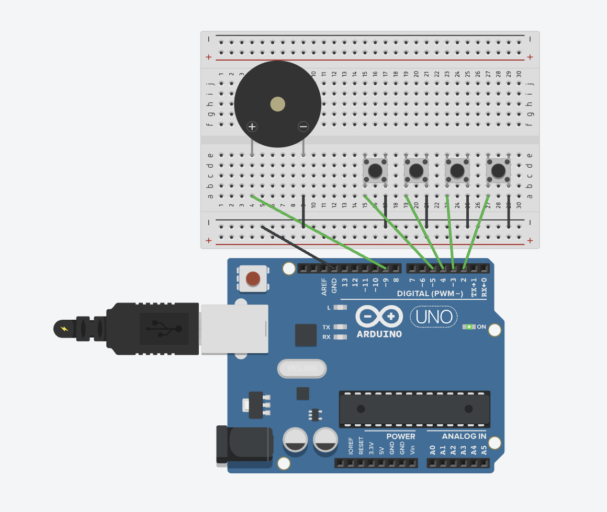

# Buzzer Button - Control Sounds with Buttons

Control buzzer sounds using push buttons. Each button plays a different note or melody. This project demonstrates how to combine digital input (buttons) with audio output (buzzer) for interactive sound control.

## 📋 Project Description

This project uses four buttons to control different sounds on a buzzer. Button 1 plays note C, Button 2 plays note E, Button 3 plays note G, and Button 4 plays a short melody. This demonstrates interactive control, edge detection, and combining multiple inputs with audio output.

**Difficulty Level:** Beginner  
**Learning Objectives:**
- Combining digital input with audio output
- Multiple button control
- Edge detection for button presses
- Interactive sound generation
- Button-triggered melodies
- Creating musical interfaces

## 🔧 Components Required

- **Arduino Board** (Uno, Nano, Mega, or compatible)
- **USB Cable** (to connect Arduino to computer)
- **Buzzer** (passive buzzer recommended)
- **Push Buttons** (4x momentary push buttons)
- **Breadboard** (for easy connections)
- **Jumper Wires** (for connections)
- **Resistor** (optional, 220Ω-330Ω for some buzzers)

## 🔌 Circuit Connections

**Circuit Connections:**

```
Buzzer Circuit:
  Buzzer Positive (+) → Pin 9 (PWM-capable pin)
  Buzzer Negative (-) → GND

Button Circuit:
  Button 1 Pin 1 → Pin 2
  Button 1 Pin 2 → GND
  Button 2 Pin 1 → Pin 3
  Button 2 Pin 2 → GND
  Button 3 Pin 1 → Pin 4
  Button 3 Pin 2 → GND
  Button 4 Pin 1 → Pin 5
  Button 4 Pin 2 → GND
```

**Visual Connection Guide:**
```
Arduino Board:
    Pin 9 (~) ────────────────────────[Buzzer Positive (+)]
    GND ──────────────────────────────[Buzzer Negative (-)]
    
    Pin 2 ────────────────────────────[Button 1 Pin 1]
    GND ──────────────────────────────[Button 1 Pin 2]
    
    Pin 3 ───────────────────────────[Button 2 Pin 1]
    GND ──────────────────────────────[Button 2 Pin 2]
    
    Pin 4 ────────────────────────────[Button 3 Pin 1]
    GND ──────────────────────────────[Button 3 Pin 2]
    
    Pin 5 ────────────────────────────[Button 4 Pin 1]
    GND ──────────────────────────────[Button 4 Pin 2]
```

**Important Notes:**
- **Buttons** use internal pull-up resistors (`INPUT_PULLUP`)
- When button is NOT pressed: pin reads HIGH
- When button IS pressed: pin reads LOW (connected to GND)
- Each button triggers a different sound
- Edge detection ensures one sound per button press

### Circuit Diagrams

**Tinkercad Simulation:**
https://www.tinkercad.com/things/2kHi522jhj3-12-buzzer-with-buttons



**Real Circuit Photo:**


## 💻 Code Explanation

### Key Concepts

**Button Control:**
- Four buttons control different sounds
- Button 1: Note C (262 Hz)
- Button 2: Note E (330 Hz)
- Button 3: Note G (392 Hz)
- Button 4: Melody (C-E-G-C)

**Edge Detection:**
- Detects moment button is pressed
- Prevents multiple sounds from one press
- Uses `lastButtonState` to compare states

**Interactive Sound:**
- User controls when sounds play
- Different buttons = different sounds
- Creates musical interface

### Key Functions

**`tone(pin, frequency, duration)`**
- Plays note for specified duration
- Automatically stops after duration
- Used for single notes

**`playMelody()`**
- Custom function to play note sequence
- Uses loop to play multiple notes
- Called when Button 4 is pressed

**Edge Detection:**
```cpp
if (buttonState == LOW && lastButtonState == HIGH)
```
- Detects button press moment
- Only triggers once per press

### Program Flow

1. **`setup()`** - Runs once:
   - Configures buzzer pin
   - Configures buttons as inputs with pull-up
   - Initializes serial communication

2. **`loop()`** - Runs continuously:
   - Read all button states
   - Check each button for press (edge detection)
   - Play corresponding sound when pressed
   - Save button states for next iteration
   - Repeat

## 🚀 Usage Instructions

### Step 1: Build the Circuit

1. **Connect Buzzer:**
   - Buzzer positive (+) → Pin 9
   - Buzzer negative (-) → GND

2. **Connect Buttons:**
   - Each button: Pin 1 → Digital pin (2, 3, 4, or 5)
   - Each button: Pin 2 → GND

### Step 2: Open and Upload Code

1. Open Arduino IDE
2. Open the file `buzzer_button.ino` from this folder
3. Connect your Arduino board
4. Select the correct board and port in Arduino IDE
5. Click **Upload** button

### Step 3: Test the Buttons

1. After uploading, open Serial Monitor (9600 baud)
2. Press Button 1 - should play C note
3. Press Button 2 - should play E note
4. Press Button 3 - should play G note
5. Press Button 4 - should play melody
6. Each button press plays its sound

## 🔍 Expected Behavior

- Pressing Button 1 plays C note (262 Hz)
- Pressing Button 2 plays E note (330 Hz)
- Pressing Button 3 plays G note (392 Hz)
- Pressing Button 4 plays melody (C-E-G-C)
- Each button press plays sound once
- Serial Monitor shows which button was pressed
- Sounds don't overlap (edge detection)

## 🛠️ Troubleshooting

### No Sound When Pressing Buttons
- Check buzzer connections
- Verify button connections
- Check button pin numbers in code
- Test buttons individually

### Multiple Sounds Per Press
- Increase delay after button detection
- Check button quality (may have bounce)
- Verify edge detection logic

### Wrong Notes Play
- Check note frequencies in code
- Verify button-to-note mapping
- Test each button individually

## 🎓 Learning Concepts

This project teaches:
- **Interactive Control:** User-triggered sounds
- **Multiple Inputs:** Handling several buttons
- **Edge Detection:** Detecting button press events
- **Audio Output:** Generating sounds on demand
- **Musical Interface:** Creating playable instrument

## 🔄 Next Steps

- Add more buttons for more notes
- Create full piano/keyboard
- Add LED indicators for active buttons
- Create rhythm patterns
- Combine with sensors for automatic sounds

## 📝 Notes

- Uses **Pin 9** for buzzer, **Pins 2-5** for buttons
- Buttons use internal pull-up resistors
- Edge detection prevents multiple triggers
- Easy to add more buttons and sounds
- Can create musical instruments

---

**Author:** XergioAleX  
**Date:** 2025  
**Version:** 1.0  
**Project:** Buzzer Button - Control Sounds with Buttons

