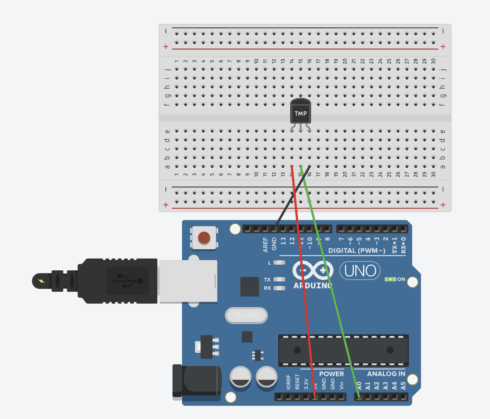
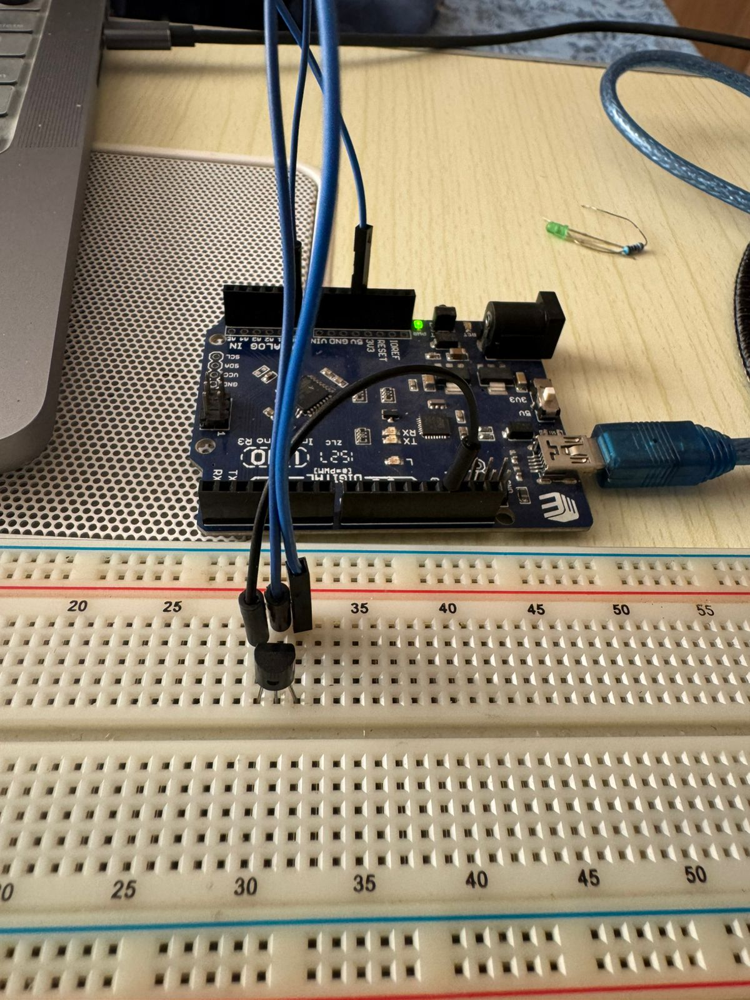

# Temperature Sensor - LM35

Read temperature from an LM35 temperature sensor and display it. This project demonstrates how to read analog sensor values, convert them to real-world measurements, and display temperature readings.

## 📋 Project Description

This project reads temperature from an LM35 temperature sensor and displays it in Celsius. The sensor provides an analog voltage proportional to temperature, which Arduino reads and converts to temperature values. This demonstrates real-world sensor reading and data conversion.

**Difficulty Level:** Beginner  
**Learning Objectives:**
- Understanding temperature sensors (LM35)
- Reading analog sensor values
- Converting voltage to temperature
- Real-world measurement and calibration
- Serial communication for data display
- Mathematical calculations in Arduino

## 🔧 Components Required

- **Arduino Board** (Uno, Nano, Mega, or compatible)
- **USB Cable** (to connect Arduino to computer)
- **LM35 Temperature Sensor** (or TMP36 compatible)
- **Breadboard** (for easy connections)
- **Jumper Wires** (for connections)

## 🔌 Circuit Connections

**Circuit Connections:**

```
LM35 Temperature Sensor:
  LM35 Pin 1 (VCC) → 5V
  LM35 Pin 2 (Output) → Pin A0 (analog input)
  LM35 Pin 3 (GND) → GND
```

**Visual Connection Guide:**
```
Arduino Board:
    5V ───────────────────────────[LM35 Pin 1 (VCC)]
    Pin A0 ───────────────────────[LM35 Pin 2 (Output)]
    GND ──────────────────────────[LM35 Pin 3 (GND)]
```

**Important Notes:**
- **LM35 has 3 pins:** VCC (power), Output (signal), GND (ground)
- **Pin 1 (VCC)** connects to 5V
- **Pin 2 (Output)** connects to analog pin A0
- **Pin 3 (GND)** connects to GND
- LM35 outputs 10mV per degree Celsius
- Temperature range: -55°C to 150°C (LM35)
- No external components needed (self-contained sensor)

### LM35 Pin Configuration

**LM35 Temperature Sensor:**
- **Pin 1 (Left):** VCC - Power supply (4V to 20V, typically 5V)
- **Pin 2 (Middle):** Output - Analog voltage output
- **Pin 3 (Right):** GND - Ground

**Output Characteristics:**
- 10mV per degree Celsius
- Example: 25°C = 0.25V, 30°C = 0.30V
- Linear output (no calibration needed)
- Accurate to ±0.5°C at 25°C

### Circuit Diagrams

**Tinkercad Simulation:**
https://www.tinkercad.com/things/aw3VUcXbqhx-13-lm35-temperature-sensor



**Real Circuit Photo:**


## 💻 Code Explanation

### Key Concepts

**Temperature Reading:**
- LM35 outputs analog voltage proportional to temperature
- 10mV = 1°C
- Arduino reads 0-1023 (0-5V range)
- Convert reading to voltage, then to temperature

**Voltage Conversion:**
- `analogRead()` returns 0-1023
- Maps to 0-5V range
- Formula: `voltage = (reading / 1023.0) * 5.0`

**Temperature Conversion:**
- LM35: 10mV per degree Celsius
- Formula: `temperature = voltage * 100`
- Example: 0.25V = 25°C

### Key Functions

**`analogRead(TEMP_SENSOR_PIN)`**
- Reads analog value from pin A0
- Returns 0-1023 (10-bit resolution)
- Represents 0V to 5V

**Voltage Calculation:**
```cpp
voltage = (sensorValue / 1023.0) * 5.0;
```
- Converts digital reading to voltage
- Uses floating-point math for accuracy

**Temperature Calculation:**
```cpp
temperature = voltage * 100.0;
```
- Converts voltage to temperature
- LM35: 10mV/°C = 0.01V/°C
- Multiply by 100 to get degrees

### Program Flow

1. **`setup()`** - Runs once when Arduino starts:
   - Initializes serial communication
   - Prints header information

2. **`loop()`** - Runs continuously:
   - Read analog value from sensor (0-1023)
   - Convert to voltage (0-5V)
   - Convert voltage to temperature (°C)
   - Print all values to Serial Monitor
   - Wait 1 second
   - Repeat

**Data Flow:**
```
LM35 Sensor
    ↓
Analog Voltage (0-5V)
    ↓
analogRead() → 0-1023
    ↓
Convert to Voltage
    ↓
Convert to Temperature (°C)
    ↓
Display on Serial Monitor
```

## 🚀 Usage Instructions

### Step 1: Build the Circuit

1. **Connect LM35 Sensor:**
   - Pin 1 (VCC) → 5V
   - Pin 2 (Output) → Pin A0
   - Pin 3 (GND) → GND

**Important:** 
- Check LM35 pin orientation (flat side usually indicates pin 1)
- Make sure connections are secure
- Sensor is sensitive - handle carefully

### Step 2: Open and Upload Code

1. Open Arduino IDE
2. Open the file `temperature_sensor.ino` from this folder
3. Connect your Arduino board
4. Select the correct board and port in Arduino IDE
5. Click **Upload** button

### Step 3: Read Temperature

1. After uploading, open Serial Monitor (9600 baud)
2. You should see temperature readings every second
3. Watch the temperature change
4. Try touching the sensor (temperature should increase)
5. Blow on the sensor (temperature may decrease slightly)

## 🔍 Expected Behavior

- Serial Monitor shows temperature readings every second
- Display format: "Sensor Value: XXX | Voltage: X.XX V | Temperature: XX.X°C"
- Temperature should be close to room temperature (20-25°C typically)
- Temperature changes when you touch or blow on sensor
- Readings update continuously
- Values should be stable (not jumping wildly)

## 🛠️ Troubleshooting

### Temperature Reading is Wrong

**Problem:** Temperature shows incorrect values
- **Solution:** Check sensor connections - all 3 pins must be connected
- **Solution:** Verify pin orientation (VCC, Output, GND)
- **Solution:** Check that pin A0 is being used (check `TEMP_SENSOR_PIN` constant)
- **Solution:** Sensor may be damaged - try a different LM35

### Temperature is Always Zero

**Problem:** Temperature always reads 0°C
- **Solution:** Check VCC connection (must be 5V)
- **Solution:** Check Output pin connection to A0
- **Solution:** Verify GND connection
- **Solution:** Test sensor by reading raw analog value

### Temperature Jumps Around

**Problem:** Temperature readings are unstable
- **Solution:** This is normal - small variations are expected
- **Solution:** Add averaging (read multiple times and average)
- **Solution:** Check for loose connections
- **Solution:** Sensor may be near heat sources or drafts

### Negative Temperature

**Problem:** Temperature shows negative values
- **Solution:** LM35 can read below 0°C (down to -55°C)
- **Solution:** This is normal if environment is cold
- **Solution:** Check if sensor is actually cold
- **Solution:** Verify calculations are correct

### Serial Monitor Shows Nothing

**Problem:** No readings in Serial Monitor
- **Solution:** Make sure Serial Monitor is set to 9600 baud
- **Solution:** Click Serial Monitor icon after uploading code
- **Solution:** Verify serial communication is initialized in `setup()`

## 🎓 Learning Concepts

This project teaches:
- **Temperature Sensors:** How LM35 works
- **Analog Reading:** Reading sensor values
- **Data Conversion:** Converting readings to real-world values
- **Mathematical Calculations:** Voltage and temperature conversions
- **Real-World Measurements:** Reading actual environmental data
- **Serial Communication:** Displaying sensor data

## 🔄 Next Steps

After mastering this project, try:
- **Temperature Display:** Show temperature on LCD display
- **Temperature Alarm:** Trigger buzzer when temperature exceeds threshold
- **Data Logging:** Record temperature over time
- **Temperature Control:** Control fan/heater based on temperature
- **Multiple Sensors:** Read from multiple temperature sensors
- **Fahrenheit Conversion:** Convert to Fahrenheit (°F)
- **Temperature Graph:** Create visual temperature graphs

## 📝 Notes

- This project uses **Pin A0** for temperature sensor
- LM35 outputs 10mV per degree Celsius
- Temperature range: -55°C to 150°C (LM35)
- Accuracy: ±0.5°C at 25°C
- No calibration needed (linear output)
- You can change pins by modifying `TEMP_SENSOR_PIN` constant
- Readings update every 1 second (adjustable)

## 🌡️ Temperature Reference

| Voltage | Temperature |
|---------|-------------|
| 0.00V | 0°C |
| 0.25V | 25°C |
| 0.30V | 30°C |
| 0.50V | 50°C |
| 1.00V | 100°C |

## 🔬 Experiment Ideas

1. **Add Averaging:**
   - Read sensor multiple times and average
   - Reduces noise and improves stability

2. **Fahrenheit Conversion:**
   - Convert Celsius to Fahrenheit
   - Formula: °F = (°C × 9/5) + 32

3. **Temperature Alarms:**
   - Set high and low temperature thresholds
   - Trigger LED or buzzer when exceeded

4. **Data Logging:**
   - Record temperature every minute
   - Store in array or send to computer

5. **Temperature Display:**
   - Show temperature on LCD
   - Update in real-time

## 📚 Related Resources

- [Arduino analogRead()](https://www.arduino.cc/reference/en/language/functions/analog-io/analogread/)
- [LM35 Datasheet](https://www.ti.com/lit/ds/symlink/lm35.pdf)
- [Temperature Sensor Tutorial](https://www.arduino.cc/en/Tutorial/TemperatureSensor)
- [Arduino Analog Input](https://www.arduino.cc/en/Tutorial/ReadAnalogVoltage)

---

**Author:** XergioAleX  
**Date:** 2025  
**Version:** 1.0  
**Project:** Temperature Sensor - LM35

