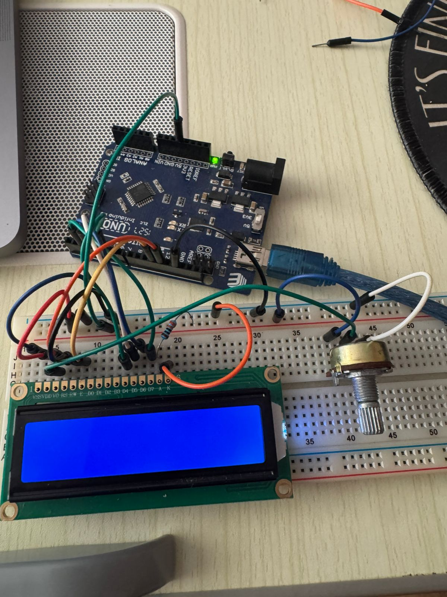
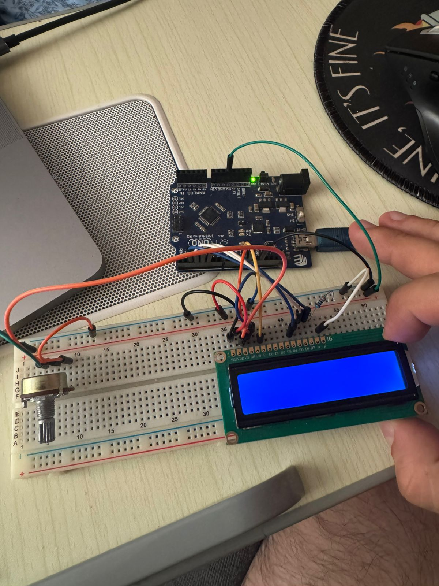

# LCD Display 16x2 - Text Display

Display text and data on a 16x2 LCD (Liquid Crystal Display) using I2C communication. This project demonstrates how to connect and use an LCD display to show information without needing the Serial Monitor.

## 📋 Project Description

This project displays text and dynamic data on a 16x2 LCD display. The LCD has 16 columns and 2 rows, allowing you to show up to 32 characters. Using I2C communication simplifies the wiring (only 4 wires needed instead of 12+ for parallel connection). This demonstrates display output, I2C communication, and text formatting.

**Difficulty Level:** Beginner  
**Learning Objectives:**
- Understanding LCD displays (16x2)
- I2C communication protocol
- Using libraries (LiquidCrystal_I2C)
- Displaying text and data
- Text positioning and formatting
- Real-time data display

## 🔧 Components Required

- **Arduino Board** (Uno, Nano, Mega, or compatible)
- **USB Cable** (to connect Arduino to computer)
- **LCD 16x2 Display** (standard 16-pin parallel LCD)
- **Breadboard** (for easy connections)
- **Jumper Wires** (for connections)
- **Potentiometer** (10kΩ, for contrast adjustment)
- **Resistor** (220Ω-330Ω, optional for backlight current limiting)

## 🔌 Circuit Connections

**Circuit Connections (4-bit mode - parallel connection):**

```
LCD 16x2 Pins:
  Pin 1 (VSS) → GND (same GND as Arduino)
  Pin 2 (VDD) → 5V
  Pin 3 (VO) → Potentiometer middle pin (contrast)
  Pin 4 (RS) → Pin 12 (Arduino)
  Pin 5 (RW) → GND (same GND as Arduino - write mode)
  Pin 6 (E) → Pin 11 (Arduino)
  Pin 7 (D0) → Not connected (4-bit mode)
  Pin 8 (D1) → Not connected (4-bit mode)
  Pin 9 (D2) → Not connected (4-bit mode)
  Pin 10 (D3) → Not connected (4-bit mode)
  Pin 11 (D4) → Pin 5 (Arduino)
  Pin 12 (D5) → Pin 4 (Arduino)
  Pin 13 (D6) → Pin 3 (Arduino)
  Pin 14 (D7) → Pin 2 (Arduino)
  Pin 15 (A) → 5V (backlight anode, optional 220Ω-330Ω resistor)
  Pin 16 (K) → GND (same GND as Arduino - backlight cathode)

**About Pins 15 and 16 (Backlight):**
These pins control the LCD's **backlight** (the light that illuminates the screen from behind).
- **Pin 15 (A)** = Anode (positive terminal) of the backlight LED
- **Pin 16 (K)** = Cathode (negative terminal) of the backlight LED
- **Function:** These pins power a small LED inside the LCD that lights up the screen
- **Optional:** You can leave them disconnected if you don't need the backlight, but the screen will be hard to see in dim light
- **Resistor:** A 220Ω-330Ω resistor is optional but recommended to limit current and protect the LED

### Quick Summary: How to Connect Pins 15 and 16

**Option 1: Simple Connection (Recommended for beginners)**
```
Pin 15 (A) → 5V (directly, no resistor)
Pin 16 (K) → GND
```
✅ **Pros:** Simple, works fine for most LCDs  
⚠️ **Cons:** LED might be slightly brighter, but usually OK

**Option 2: With Resistor (Recommended for safety)**
```
Pin 15 (A) → 220Ω-330Ω Resistor → 5V
Pin 16 (K) → GND
```
✅ **Pros:** Protects LED, extends lifespan  
⚠️ **Cons:** Slightly dimmer (but still very visible)
✅ **Note:** 330Ω works perfectly fine! It will make the backlight slightly dimmer but safer.

**Option 3: No Backlight (Not recommended)**
```
Pin 15 (A) → Not connected
Pin 16 (K) → Not connected
```
❌ **Result:** Screen will be very hard to see (text barely visible)

**My Recommendation:**
- **Start with Option 1** (simple, direct connection)
- If the backlight seems too bright or you want to be extra safe, use **Option 2** (with resistor)
- **Always connect both pins** - don't leave them disconnected unless you're in very bright sunlight

**Important:** All three GND connections (Pins 1, 5, and 16) connect to the **SAME GND** on your Arduino or breadboard. This is correct and necessary!

Potentiometer (10kΩ):
  Left pin → 5V
  Middle pin → LCD Pin 3 (VO)
  Right pin → GND
```

**Visual Connection Guide:**
```
Arduino Board:
    5V ───────────────────────────[LCD Pin 2 (VDD)]
    5V ───────────────────────────[Potentiometer Left]
    5V ───────────────────────────[LCD Pin 15 (A) - Backlight]
    
    GND ──────────────────────────[LCD Pin 1 (VSS)]
         └────────────────────────[LCD Pin 5 (RW)]
         └────────────────────────[LCD Pin 16 (K) - Backlight]
         └────────────────────────[Potentiometer Right]
    (All GND connections go to the SAME GND point!)
    
    Pin 12 ───────────────────────[LCD Pin 4 (RS)]
    Pin 11 ───────────────────────[LCD Pin 6 (E)]
    Pin 5 ────────────────────────[LCD Pin 11 (D4)]
    Pin 4 ────────────────────────[LCD Pin 12 (D5)]
    Pin 3 ────────────────────────[LCD Pin 13 (D6)]
    Pin 2 ────────────────────────[LCD Pin 14 (D7)]
    
    Potentiometer Middle ─────────[LCD Pin 3 (VO)]
```

**Note:** In a breadboard, you typically use the **GND rail** (the blue/black strip along the side). All three LCD GND pins (1, 5, 16) and the potentiometer GND can connect to the same GND rail, which is then connected to Arduino GND. This is the standard and correct way to do it!

**Important Notes:**
- **4-bit mode:** Only D4-D7 are connected (D0-D3 not used)
- **RW pin:** Connected to GND (write-only mode)
- **Potentiometer:** Required for contrast adjustment (10kΩ recommended)
- **Backlight:** Pins A and K control backlight (optional resistor for current limiting)
- **Power:** LCD needs 5V (VDD pin)
- **Contrast:** Adjust potentiometer if text is not visible

### Why Do We Need a Potentiometer?

**The potentiometer controls the LCD contrast (brightness/darkness of the text).**

**What happens without a potentiometer:**
- LCD screen will show only **black squares** (all pixels on)
- OR completely **blank screen** (all pixels off)
- **Text will NOT be visible** - you won't be able to read anything

**What the potentiometer does:**
- **Pin VO (Pin 3)** needs a variable voltage (between 0V and 5V)
- Potentiometer acts as a **voltage divider**
- Adjusting the potentiometer changes the voltage on VO pin
- This voltage controls how dark/light the LCD pixels appear
- **Correct voltage = readable text**
- **Wrong voltage = invisible text (too dark or too light)**

**How it works:**
```
Potentiometer creates variable voltage:
- Turn one way → Higher voltage → Darker text (may be invisible)
- Turn other way → Lower voltage → Lighter text (may be invisible)
- Middle position → Optimal voltage → Clear, readable text
```

**Visual Example:**
- **Too much voltage (VO near 5V):** All pixels ON = black squares
- **Too little voltage (VO near 0V):** All pixels OFF = blank screen
- **Correct voltage (VO ~0.5-2V):** Text is visible and clear

**In summary:** The potentiometer is **essential** - without it, you cannot see the text on the LCD, even if everything else is connected correctly!

### Can I Use a Fixed Resistor Instead of a Potentiometer?

**Short answer:** Technically yes, but **not recommended**.

**Why a potentiometer is better:**
- Each LCD module has slightly different contrast requirements
- Contrast can vary with temperature
- Different viewing angles may need adjustment
- Manufacturing tolerances mean each LCD is slightly different
- **You need to adjust it to find the "sweet spot"** for your specific LCD

**If you want to try a fixed resistor:**
- You can use a **voltage divider** with two fixed resistors
- Common values: 10kΩ + 1kΩ resistors (creates ~0.45V)
- Or: 4.7kΩ + 1kΩ resistors (creates ~0.88V)
- **Problem:** If the voltage isn't right for your LCD, text won't be visible and you can't adjust it
- **Solution:** Use a potentiometer - it's cheap and gives you control

**Recommendation:** Always use a potentiometer for LCD 16x2 displays. It's inexpensive and ensures you can always see the text clearly.

### Do Other Display Types Need a Potentiometer?

**LCD 16x2 (like yours):** ✅ **YES** - Always needs contrast adjustment (potentiometer or fixed resistor)

**LCD with I2C Module:** ⚠️ **Sometimes** - Many I2C modules have contrast pre-adjusted, but some still have a small trimmer potentiometer

**OLED Displays:** ❌ **NO** - OLED displays don't need contrast adjustment (they're self-lit pixels)

**TFT/Color Displays:** ❌ **NO** - Modern TFT displays have digital contrast control via software

**E-Paper/E-Ink Displays:** ❌ **NO** - These displays work differently and don't need contrast adjustment

**7-Segment Displays:** ❌ **NO** - LED-based, no contrast needed

**Summary:**
- **Traditional LCD 16x2 (parallel connection):** Always needs potentiometer
- **LCD with I2C module:** Usually pre-adjusted, but may have small trimmer
- **Modern displays (OLED, TFT):** No potentiometer needed - contrast controlled digitally

### LCD 16x2 Pin Configuration

**LCD 16x2 Standard Pins:**
- **Pin 1 (VSS)** - Ground (0V) - Power supply ground
- **Pin 2 (VDD)** - Power supply (5V)
- **Pin 3 (VO)** - Contrast adjustment (connect to potentiometer)
- **Pin 4 (RS)** - Register Select (data/command selection)
- **Pin 5 (RW)** - Read/Write (GND for write mode)
- **Pin 6 (E)** - Enable (strobe pin)
- **Pin 7-10 (D0-D3)** - Data bits (not used in 4-bit mode)
- **Pin 11-14 (D4-D7)** - Data bits (used in 4-bit mode)
- **Pin 15 (A)** - Backlight anode (+)
- **Pin 16 (K)** - Backlight cathode (-)

### Circuit Diagrams

**Tinkercad Simulation:**
https://www.tinkercad.com/things/jt00zF4jW4D-15-lcd-display-16x2


**Real Circuit Photos:**




### Understanding the Three GND Connections

**You connect three different pins to GND, but they serve different purposes:**

#### Pin 1 (VSS) → GND
**Purpose:** Power supply ground (reference voltage)
- This is the **main ground** for the LCD's internal electronics
- Provides the **reference voltage (0V)** for all LCD operations
- **Essential** - LCD won't work without this connection
- **Function:** Powers the LCD controller chip and display circuitry
- **Think of it as:** The "negative terminal" of the LCD's power supply

#### Pin 5 (RW) → GND
**Purpose:** Control pin (not actually a ground pin)
- **RW** stands for "Read/Write"
- This is a **control signal**, not a power connection
- Connecting it to GND puts the LCD in **"Write Mode"** (we only write to LCD, never read)
- **Alternative:** Could be connected to a digital pin if you wanted to read from LCD (rare)
- **Function:** Tells LCD whether to accept data (write) or send data (read)
- **Think of it as:** A switch that says "I'm sending data TO the LCD"

#### Pin 16 (K) → GND
**Purpose:** Backlight cathode (LED negative terminal)
- **K** stands for "Kathode" (cathode)
- This is the **negative terminal of the backlight LED**
- Pin 15 (A) is the positive terminal (anode) connected to 5V
- Together, pins 15 and 16 power the **backlight LED** that illuminates the screen
- **Function:** Completes the circuit for the backlight LED
- **Think of it as:** The "negative terminal" of a small LED light bulb

### Understanding the Backlight (Pins 15 and 16)

**What is the backlight?**
- The **backlight** is a small LED (light-emitting diode) inside the LCD
- It shines light **behind** the LCD screen to make the text visible
- Without the backlight, the LCD text is very hard to see (especially in dim light)
- Think of it like the light in your phone or computer screen

**How it works:**
```
Pin 15 (A) → 5V ──┐
                   ├──→ [LED inside LCD] ──→ Pin 16 (K) → GND
                   └──→ (Optional: 220Ω-330Ω resistor here)
```

**Simple analogy:**
- **Pin 15 (A)** = Positive terminal of a battery (+)
- **Pin 16 (K)** = Negative terminal of a battery (-)
- **The LED** = A small light bulb between them
- When you connect + to 5V and - to GND, the LED lights up!

**Why is it optional?**
- The LCD **will work** without the backlight (text will still display)
- But the text will be **very hard to see** in normal lighting
- The backlight makes the screen bright and easy to read
- **Recommendation:** Always connect the backlight unless you're in very bright sunlight

**Why the resistor (220Ω-330Ω) is optional:**
- The resistor **limits the current** flowing through the LED
- Protects the LED from burning out (LEDs can be damaged by too much current)
- **Without resistor:** LED might be brighter but could burn out faster
- **With resistor:** LED is slightly dimmer but safer and lasts longer
- **Most LCDs work fine without the resistor**, but it's good practice to use it

**Visual Example:**
```
Without Backlight:  [Dark screen, text barely visible]
With Backlight:     [Bright screen, text clearly visible] ✨
```

**Summary:**
```
Pin 1 (VSS) → GND  = Power supply ground (LCD electronics)
Pin 5 (RW)  → GND  = Control signal (write mode selection)
Pin 16 (K)  → GND  = Backlight LED negative terminal
```

**Why all three go to GND:**
- **Pin 1:** Needs GND for power (like any electronic device)
- **Pin 5:** Needs LOW signal (GND = LOW = write mode)
- **Pin 16:** Needs GND to complete LED circuit (LED needs + and - terminals)

**Important:** All three connect to the **same GND** on your Arduino - they're all part of the same ground reference in your circuit!

**LCD Display:**
- 16 columns × 2 rows = 32 characters total
- Each character is 5×8 pixels
- Built-in character set (letters, numbers, symbols)
- Backlight (usually blue or white)

**4-bit Mode:**
- Uses only 4 data lines (D4-D7) instead of 8
- Saves Arduino pins
- Slightly slower but sufficient for most applications
- Standard mode for Arduino projects

## 💻 Code Explanation

### Key Concepts

**LCD Display:**
- 16 columns (characters per line)
- 2 rows (lines)
- Each position can display one character
- Cursor position: (column, row) where column 0-15, row 0-1

**Parallel Communication (4-bit mode):**
- Uses 6 digital pins (RS, E, D4, D5, D6, D7)
- 4-bit mode uses only upper 4 data bits
- Faster than I2C but uses more pins
- Standard connection method for LCD displays

**LiquidCrystal Library:**
- Built-in Arduino library (no installation needed)
- Handles parallel communication automatically
- Provides easy functions to control LCD
- Supports both 4-bit and 8-bit modes

### Key Functions

**`LiquidCrystal lcd(RS, E, D4, D5, D6, D7)`**
- Creates LCD object
- RS: Register Select pin (Pin 12)
- E: Enable pin (Pin 11)
- D4-D7: Data pins (Pins 5, 4, 3, 2)
- Defines pin connections for 4-bit mode

**`lcd.begin(columns, rows)`**
- Initializes the LCD display
- Must be called in `setup()`
- Columns: 16
- Rows: 2
- Prepares LCD for use

**`lcd.setCursor(column, row)`**
- Sets cursor position
- Column: 0-15 (left to right)
- Row: 0-1 (top to bottom)
- Next `print()` will start at this position

**`lcd.print(text)`**
- Prints text to LCD at current cursor position
- Can print strings, numbers, variables
- Similar to `Serial.print()`

**`lcd.clear()`**
- Clears entire display
- Moves cursor to position (0, 0)
- Useful before updating display

### Program Flow

1. **`setup()`** - Runs once when Arduino starts:
   - Initialize serial communication
   - Initialize LCD with I2C address
   - Turn on backlight
   - Display welcome message
   - Wait 2 seconds

2. **`loop()`** - Runs continuously:
   - Clear display
   - Display elapsed time (seconds)
   - Display counter (increments each loop)
   - Update every 1 second
   - Repeat

**Display Layout:**
```
Row 0: "Time: XXX seconds"
Row 1: "Counter: XXX"
```

## 🚀 Usage Instructions

### Step 1: Build the Circuit

1. **Connect LCD Power:**
   - Pin 1 (VSS) → GND
   - Pin 2 (VDD) → 5V
   - Pin 15 (A) → 5V (backlight, optional 220Ω-330Ω resistor)
   - Pin 16 (K) → GND (backlight)

2. **Connect LCD Control Pins:**
   - Pin 4 (RS) → Pin 12 (Arduino)
   - Pin 5 (RW) → GND
   - Pin 6 (E) → Pin 11 (Arduino)

3. **Connect LCD Data Pins (4-bit mode):**
   - Pin 11 (D4) → Pin 5 (Arduino)
   - Pin 12 (D5) → Pin 4 (Arduino)
   - Pin 13 (D6) → Pin 3 (Arduino)
   - Pin 14 (D7) → Pin 2 (Arduino)

4. **Connect Potentiometer for Contrast:**
   - Left pin → 5V
   - Middle pin → LCD Pin 3 (VO)
   - Right pin → GND

**Important:** 
- Make sure all connections are secure
- Adjust potentiometer if text is not visible
- Check pin numbers on your LCD (usually labeled)
- Backlight pins (A and K) are optional but recommended

### Step 2: Open and Upload Code

1. Open Arduino IDE
2. Open the file `lcd_display.ino` from this folder
3. **No library installation needed** - LiquidCrystal is built-in
4. Connect your Arduino board
5. Select the correct board and port in Arduino IDE
6. Click **Upload** button

### Step 3: Adjust and View Display

1. After uploading, adjust potentiometer until text is visible
2. LCD should show:
   - First line: "Hello, Arduino!"
   - Second line: "LCD 16x2 Works!"
3. After 2 seconds, display updates:
   - First line: Elapsed time in seconds
   - Second line: Counter value
4. Values update every second
5. Open Serial Monitor to see same data
6. If text is too dark or too light, adjust potentiometer

## 🔍 Expected Behavior

- LCD displays welcome message for 2 seconds
- Then shows elapsed time and counter
- Time increments every second
- Counter increments every second
- Display updates continuously
- Backlight is on (text is visible)
- Serial Monitor shows same information

## 🛠️ Troubleshooting

### LCD Shows Nothing / Blank Display

**Problem:** LCD is blank or shows only squares
- **Solution:** Adjust potentiometer (contrast) - this is the most common issue
- **Solution:** Verify all connections are secure
- **Solution:** Check power connections (VDD to 5V, VSS to GND)
- **Solution:** Verify data pins are connected correctly (D4-D7 to pins 5, 4, 3, 2)
- **Solution:** Check that RS and E pins are connected (pins 12 and 11)
- **Solution:** Try rotating potentiometer slowly to find correct contrast

### LCD Shows Only Squares

**Problem:** LCD shows only block characters (squares)
- **Solution:** This usually means LCD is not initialized properly
- **Solution:** Check that `lcd.begin(16, 2)` is called in `setup()`
- **Solution:** Verify all pin connections match code
- **Solution:** Check that RW pin is connected to GND
- **Solution:** Try adjusting contrast potentiometer

### Text is Too Dark or Too Light

**Problem:** Text is barely visible or too bright
- **Solution:** Adjust potentiometer connected to VO pin
- **Solution:** Rotate potentiometer slowly until text is clear
- **Solution:** If still not visible, check potentiometer connections
- **Solution:** Try different potentiometer value (10kΩ recommended)

### Text Overlaps or Doesn't Fit

**Problem:** Text goes beyond screen or overlaps
- **Solution:** Use `lcd.setCursor()` to position text correctly
- **Solution:** Clear display with `lcd.clear()` before updating
- **Solution:** Limit text to 16 characters per line
- **Solution:** Use `lcd.setCursor(0, 1)` for second line

### Display Flickers or Updates Slowly

**Problem:** Display flickers or updates are slow
- **Solution:** This is normal - LCD updates take time
- **Solution:** Reduce update frequency (increase delay)
- **Solution:** Only update changed values, not entire display
- **Solution:** Use `lcd.setCursor()` to update specific positions

## 🎓 Learning Concepts

This project teaches:
- **LCD Displays:** How 16x2 LCD works
- **Parallel Communication:** 4-bit parallel data transfer
- **Libraries:** Using built-in Arduino libraries
- **Text Display:** Showing information visually
- **Data Formatting:** Formatting numbers and text for display
- **Real-time Updates:** Updating display with changing data
- **Pin Management:** Using multiple digital pins efficiently

## 🔄 Next Steps

After mastering this project, try:
- **Display Sensor Data:** Show temperature, distance, or light readings
- **Custom Characters:** Create custom symbols and characters
- **Scrolling Text:** Create scrolling text effects
- **Menu System:** Create simple menu navigation
- **Multiple Screens:** Switch between different display screens
- **LCD with Buttons:** Add buttons to navigate menus
- **Data Logging Display:** Show logged sensor data

## 📝 Notes

- This project uses **parallel communication** (4-bit mode)
- **Library:** LiquidCrystal (built-in, no installation needed)
- **Pins Used:** 12 (RS), 11 (E), 5 (D4), 4 (D5), 3 (D6), 2 (D7)
- **Display Size:** 16 columns × 2 rows = 32 characters
- **Contrast:** Controlled by potentiometer (10kΩ recommended)
- **Backlight:** Pins A and K (optional, but recommended)
- Can combine with sensors to display real-time data
- Can change pin assignments in code if needed

## 📚 Related Resources

- [Arduino LiquidCrystal Library](https://www.arduino.cc/reference/en/libraries/liquidcrystal/)
- [I2C Communication](https://www.arduino.cc/en/Reference/Wire)
- [LCD Display Tutorial](https://www.arduino.cc/en/Tutorial/HelloWorld)
- [I2C Scanner Sketch](https://playground.arduino.cc/Main/I2cScanner/)

---

**Author:** XergioAleX  
**Date:** 2025  
**Version:** 1.0  
**Project:** LCD Display 16x2 - Text Display

